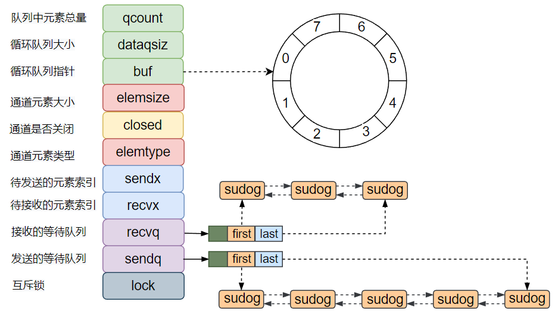

Go并发编程
===

## 前置知识

### 并发、并行

  - 并发：在并发中，这些任务可以在同一个时间段内**交替执行**，每个任务都有可能在任意时刻被暂停或切换，以便给其他任务执行的机会。并发可以提高系统的吞吐量和资源利用率，但并不一定意味着同时进行多个任务的实际并行执行。
    - 需要多核CPU支持。

  - 并行：指系统中多个任务同时进行实际的并发执行，每个任务都有自己的执行线程或处理器核心。在并行中，多个任务可以**同时进行**，彼此之间**相互独立**，互不干扰。并行可以通过多核处理器、分布式系统等实现，以提高任务的执行速度和效率。

### 同步、异步

- 同步：执行一个操作之后，等待结果，然后才继续执行后续的操作。操作之间有顺序要求，是一种线性执行的方式。
- 异步：执行一个操作后，可以去执行其他的操作，然后等待通知再回来执行刚才没执行完的操作。操作之间没有顺序要求，是一种并行处理的方式。


### 进程

- 进程是程序执行的过程，包括了动态创建、调度和消亡的整个过程，进程是操作系统**分配**资源的基本单位
- 进程通常管理包括内存资源、IO资源、信号处理等部分。
  - 内存管理，采用虚拟内存技术，把进程虚拟地址空间划分成**用户空间和内核空间**。

### 线程

- 线程是操作操作系统能够进行运算调度的最小单位。**线程被包含在进程之中**，是进程中的实际运作单位，一个进程内可以包含多个线程，线程是资源调度的最小单位。
- 同一进程中的多条线程共享该进程中的全部系统资源，如虚拟地址空间，文件描述符文件描述符和信号处理等等。
- 同一进程中的多个线程有各自的调用栈、寄存器环境、线程本地存储等信息。
- 线程间切换
  - 线程是被内核所调度，线程被调度切换到另一个线程上下文的时候，需要保存一个用户线程的状态到内存
  - 恢复另一个线程状态到寄存器，然后更新调度器的数据结构，这几步操作涉及**用户态到内核态转换**，开销比较多。

### 协程

IO 密集型服务的瓶颈不在 CPU 处理速度，而在于尽可能快速的完成高并发、多连接下的数据读写。

- 如果用多线程，高并发场景的大量 IO 等待会导致多线程被频繁挂起和切换，非常消耗系统资源，同时多线程访问共享资源存在竞争问题。
- 如果用多进程，不仅存在频繁调度切换问题，同时还会存在每个进程资源不共享的问题，需要额外引入进程间通信机制来解决。

协程 Coroutines 是一种比线程更加轻量级的**微线程**，**用户态线程**。类比一个进程可以拥有多个线程，一个线程也可以拥有多个协程，因此协程又称微线程和纤程。

协程有独立的栈空间，但是共享堆空间

- 协程间切换
  - 调度完全由用户控制，协程拥有自己的寄存器上下文和栈，协程调度切换时，将寄存器上下文和栈保存到其他地方
  - 在切回来的时候，恢复先前保存的寄存器上下文和栈，直接操作用户空间栈，**完全没有内核切换**的开销。
- 动态协程栈
  - Goroutine 的栈只有 2KB大小，而且是动态伸缩的，可以按需调整大小，最大可达 1G。
  - 相比之下，线程也都有一个固定大小的内存块来做栈，一般会是 2MB 大小，线程栈会用来存储线程上下文信息。2MB 的线程栈和协程栈相比大了很多。

## Goroutine

### 是什么，有什么用

- 协程是**轻量级的线程**，与传统的进程和线程相比，协程的最大特点是 "轻"！可以轻松创建上百万个协程而不会导致系统资源衰竭。

- 线程本身是有一定大小的，一般OS线程栈大小为**2MB，**且线程在创建和上下文切换的时候是需要消耗资源的，会带来性能损耗，所以在我们用到多线程技术的时候，我们往往会通过池化技术，即创建线程池来管理一定数量的线程。

- 在go语言中，一个goroutine栈在其生命周期开始时占用空间很小（一般2KB），并且栈大小可以按需增大和缩小，goroutine的栈大小限制可以达到1GB，但是一般不会用到这么大。所以在Go语言中一次创建成千上万，甚至十万左右的goroutine理论上也是可以的。

### 怎么用

```go
func()

go func()
```

- 将需要并发的任务封装成一个函数，然后再该函数前加上go关键字就行了，这样就开启了一个goroutine。

```Go
package main

import (
    "fmt"
    "sync"
    "time"
)

func say(id string) {
    time.Sleep(time.Second)
    fmt.Println("I am done ! id: " + id)
    wg.Done() //wg中值 - 1
}

var wg sync.WaitGroup

func main() {

    wg.Add(2) // wait two groutines

    go func(id string) {
       fmt.Println(id)
       wg.Done()
    }("hello")

    go say("Hello")

    wg.Wait() // 等待所有任务完成，卡住如果wg不是0
    fmt.Println("exit")
}
```

- 定义一个WaitGroup， wg.Add告知要等待执行的任务，wg.Done在完成后减少计数，wg.Wait挂起
- 匿名函数也可以使用Groutine

### 多协程异常捕获

```go
package main

import (
   "fmt"
   "time"
)

func main() {
   defer func() {
      if e := recover(); e != nil {
         fmt.Printf("main recover:%v\n", e)
      }
   }()

   go func() {
      defer func() {
         if e := recover(); e != nil {
            fmt.Printf("sub recover:%v\n", e)
         }
      }()
      panic("sub func panic!!!")  // 发生panic后，不会打印
      fmt.Println("111")
   }()

   panic("main func panic!!!")
   panic("main func panic!!!") // 一个recover，只能捕获一次pannic
   fmt.Println("222")   // 发生panic后，不会打印
   time.Sleep(2 * time.Second)
}
```

- 用recover捕获异常时，只能捕获当前goroutine的panic，不能捕获其他goroutine发生的panic。
- main panic需要在main中设置对应的recover，goroutine中的panic也需要有对应的设置。
- 因为开启 goroutine 的唯一方法就是将 `go` 放在函数调用前面，所以当我们想要启动 goroutine 时，我们经常使用 *匿名函数（anonymous functions）*，这样可以实现协程运行部分语句。
  - 匿名函数在末尾没有括号时是声明，加上括号可以在声明的同时执行。

- Sleep避免运行完直接退出，没有等待goroutine。

## Channel

### 是什么

- Channel是一个通信管道，用来在goroutine中传递信息，是不同的goroutine能够通信，实现通过通信共享内存。
- 通过channel与select的搭配使用以及调度器对goroutine的调度，可以高效的实现协程的阻塞和唤醒以及多路复用。
- Channel是可以定义方向的，单向接受或者发送数据，双向。
- 同时是一个先进先出的。

```Go
var ch = make(chan int)
type RChannel= <-chan int    // 定义单向读类型，chan出去，读出来
var rec RChannel = ch

type SChannel = chan<- int  //  定义单向写类型，指向chan写进去
var send SChannel = ch
```

```Go
chan T          // 可以接收和发送类型为 T 的数据
chan<- float64  // 只可以用来发送 float64 类型的数据
<-chan int      // 只可以用来接收 int 类型的数据
```

- Channel可以分为有缓冲的和无缓冲的
  - 无缓冲 channel 可以理解为同步模式，即写入一个，如果没有消费者在消费，写入就会阻塞，读取也会阻塞。
  - 有缓冲 channel 可以理解为异步模式。即写入消息之后，即使还没被消费，只要队列没满，就可继续写入。
  - 如果有缓冲 channel 队列满了，那不就退化到同步了么？是的，如果队列满了，发送还是会阻塞。
  - 使用range遍历有缓存通道值时，需要先`close(ch)`，否则会deadlock。


```Go
ch := make(chan int)
ch := make(chan int, 100)

close(ch)
for val := range ch {
    fmt.Println(val)
}
```

- 如果channel c已经被关闭，继续往它发送数据会导致`panic: send on closed channel`:

- 从这个关闭的channel中不但可以读取出已发送的数据，还可以不断的读取nil。

  ```go
  go func() {
        for i := 0; i < 5; i++ {
           v,ok := <-ch     // 判断句式读取，检查通道是否关闭
           if ok{
              fmt.Printf("v=%d\n", v)
           }else{
              fmt.Printf("channel数据已读完\n")
           }
        }
  }()
  
  package main
  
  import (
     "fmt"
     "time"
  )
  
  func main() {
     ch := make(chan int, 5)
     ch <- 1
     ch <- 2
     close(ch)
     go func() {
        for v := range ch {
           fmt.Printf("v=%d\n", v)
        }
     }()
     time.Sleep(2 * time.Second)
  }
  ```

  - 如果通过`range`读取，channel关闭后for循环会跳出，避免读取关闭后的零值。

- 默认情况下，发送和接收会一直阻塞着，直到另一方准备好。这种方式可以用来在gororutine中进行同步，而不必使用显示的锁或者条件变量，channel是**并发安全的**。

### 数据结构

channel在用make函数创建初始化时，会在堆上分配一个runtime.hchan类型数据结构，并返回指向堆上这块hchan内存区域，所以channel是一个引用类型，channel本身就是一个指针。

> 为什么在堆上创建？
>
> channel用来实现goroutine间通信，生命周期不局限于某个具体函数内。



- sendq 和 recvq 存储了当前 Channel 由于缓冲区空间不足而阻塞的 Goroutine 列表，这些等待队列使用双向链表 waitq 表示，链表中所有的元素都是 sudog 结构。
- sendx是可以通过管道send到的index，recvx是可以通过管道recv到的index。
- 为什么用循环队列：
- 发送和接受过程是会加锁释放锁的，所以是并发安全的。

## Context

### 是什么，用来做什么

- context 主要用来在 goroutine 之间传递上下文信息，包括：取消信号、超时时间、截止时间、k-v 等。
  - 一个请求在多个协程中运行时，当其中一个出现错误，剩下的运行没有了意义，可以通过context通知子goroutine优雅关闭
- 在Go里不能Go里不能杀死协程，协程的关闭一般会用 `channel+select` 方式来控制。
  - 在某些场景下，例如处理一个请求衍生了很多协程，这些协程之间是相互关联的：需要共享一些全局变量、有共同的 deadline 等，而且可以同时被关闭。再用 `channel+select` 就会比较麻烦，这时就可以通过 context 来实现。

### 接口

#### context

```Go
type Context interface {
    // 当 context 被取消或者到了 deadline，返回一个被关闭的 channel
    Done() <-chan struct{}

    // 在 channel Done 关闭后，返回 context 取消原因
    Err() error

    // 返回 context 是否会被取消以及自动取消时间（即 deadline）
    Deadline() (deadline time.Time, ok bool)

    // 获取 key 对应的 value
    Value(key interface{}) interface{}
}
```

- `Context` 是一个接口，定义了 4 个方法，它们都是`幂等`的。也就是说连续多次调用同一个方法，得到的结果都是相同的。
- `Done() <-chan struct{}`这里返回是一个只读的Channel，对于没有传递值的Channel，读不出任何的值，当Channel关闭时，可以读取对应类型的nil值，作为channel关闭的信号，表明要尽快做退出处理。
- `Err()` 返回一个错误，表示 channel 被关闭的原因。例如是被取消，还是超时。
  - 只会在 Done 返回的 Channel 被关闭时才会返回非空的值，返回值有以下两种情况； 
    - 如果 是context.Context 被取消，返回 Canceled 
    - 如果 是context.Context 超时，返回 DeadlineExceeded 

- `Deadline()` 返回 context 的截止时间，通过此时间，函数就可以决定是否进行接下来的操作，如果时间太短，就可以不往下做了，否则浪费系统资源。当然，也可以用这个 deadline 来设置一个 I/O 操作的超时时间。
- `Value()` 获取之前设置的 key 对应的 value。

#### canceler

```go
type canceler interface {
    cancel(removeFromParent bool, err error)
    Done() <-chan struct{}
}
```

- 实现上面定义的两个方法的Context，表明该Context是可以取消的
- 为什么这样设计
  - “取消”操作应该是建议性，而非强制性。只有实现了这个接口，Context才会是可取消的。caller 不应该去关心、干涉 callee 的情况，决定如何以及何时 return 是 callee 的责任。caller 只需发送“取消”信息，callee 根据收到的信息来做进一步的决策，因此接口并没有定义 cancel 方法。
  - “取消”操作应该可传递。“取消”某个函数时，和它相关联的其他函数也应该“取消”。因此，`Done()` 方法返回一个只读的 channel，所有相关函数监听此 channel。一旦 channel 关闭，通过 channel 的“广播机制”，所有监听者都能收到。

#### emptyCtx

```go
type emptyCtx int

func (*emptyCtx) Deadline() (deadline time.Time, ok bool) {
    return
}

func (*emptyCtx) Done() <-chan struct{} {
    return nil
}

func (*emptyCtx) Err() error {
    return nil
}

func (*emptyCtx) Value(key interface{}) interface{} {
    return nil
}
```

- 这是一个空的 context，永远不会被 cancel，没有存储值，也没有 deadline。

通常被包装后，通过两个导出函数导出

```go
var (
    background = new(emptyCtx)
    todo       = new(emptyCtx)
)

// 注意首字母大写
func Background() Context {
    return background
}

func TODO() Context {
    return todo
}
```

- background 通常用在 main 函数中，作为所有 context 的根节点。
- todo 通常用在并不知道传递什么 context的情形。例如，调用一个需要传递 context 参数的函数，你手头并没有其他 context 可以传递，这时就可以传递 todo。这常常发生在重构进行中，给一些函数添加了一个 Context 参数，但不知道要传什么，就用 todo “占个位子”，最终要换成其他 context。

#### cancelCtx

```go
type cancelCtx struct {
    Context

    // 保护之后的字段
    mu       sync.Mutex
    done     chan struct{}
    children map[canceler]struct{}
    err      error
}
```

一个可以取消的 Context，实现了 canceler 接口。它直接将接口 Context 作为它的一个匿名字段，这样，它就可以被看成一个 Context。

### 如何使用

- 源码里对外提供了一个创建根节点 context 的函数

  ```go
  ctx := context.Background()
  ctx := context.TODO()
  ```

  - background 是一个空的 context， 它不能被取消，没有值，也没有超时时间。可以用在main函数或者顶级请求中来派生其他context
  - 使用TODO函数获得一个空context，只能用于高等级或者不确定使用什么context类型。

- 有了根节点 context，又提供了四个函数创建子节点 context：

  ```go
  func WithCancel(parent Context) (ctx Context, cancel CancelFunc)
  func WithDeadline(parent Context, deadline time.Time) (Context, CancelFunc)
  func WithTimeout(parent Context, timeout time.Duration) (Context, CancelFunc)
  func WithValue(parent Context, key, val interface{}) Context
  ```

  - context 会在函数传递间传递。只需要在适当的时间调用 cancel 函数向 goroutines 发出取消信号或者调用 Value 函数取出 context 中的值。
  - 基于当前context，每个with函数都会创建出一个新的context，这样类似于我们熟悉的树结构，当前context称为父context，派生出的新context称为子context。就像下面的context树结构：

  

  - 通过根context，通过四个with系列方法可以派生出四种类型的context，每种context又可以通过同样的方式调用with系列方法继续向下派生新的context，整个结构像一棵树。

- 使用建议

  - 不要将 Context 塞到结构体里。直接将 Context 类型作为函数的第一参数，而且一般都命名为 ctx。
  - 不要向函数传入一个 nil 的 context，如果你实在不知道传什么，标准库给你准备好了一个 context：todo。
  - 不要把本应该作为函数参数的类型塞到 context 中，context 存储的应该是一些共同的数据。例如：登陆的 session、cookie 等。
  - 同一个 context 可能会被传递到多个 goroutine，别担心，context 是并发安全的。


#### context.WithCancel

```Go
package main

import (
   "context"
   "fmt"
   "time"
)

func main() {
   ctx, cancel := context.WithCancel(context.Background())
   go Watch(ctx, "goroutine1")
   go Watch(ctx, "goroutine2")

   time.Sleep(6 * time.Second)   // 让goroutine1和goroutine2执行6s
   fmt.Println("end watching!!!")
   cancel()  // 通知goroutine1和goroutine2关闭
   time.Sleep(1 * time.Second)
}

func Watch(ctx context.Context, name string) {
   for {
      select {
      case <-ctx.Done():
         fmt.Printf("%s exit!\n", name) // 主goroutine调用cancel后，会发送一个信号到ctx.Done()这个channel，这里就会收到信息
         return
      default:
         fmt.Printf("%s watching...\n", name)
         time.Sleep(time.Second)
      }
   }
}
```

- context.WithCancel是一个取消控制函数。
- ctx, cancel := context.WithCancel(context.Background())派生出了一个带有返回函数cancel的ctx
- 将之传到goroutine当中，当执行cancel函数时，此时子goroutine会从ctx.Done()这个channel中收到消息，执行return结束。

#### context.WithDeadline

```Go
package main

import (
   "context"
   "fmt"
   "time"
)

func main() {
   ctx, cancel := context.WithDeadline(context.Background(),time.Now().Add(4*time.Second)) // 设置超时时间4当前时间4s之后
   defer cancel()
   go Watch(ctx, "goroutine1")
   go Watch(ctx, "goroutine2")

   time.Sleep(6 * time.Second)   // 让goroutine1和goroutine2执行6s
   fmt.Println("end watching!!!")
}

func Watch(ctx context.Context, name string) {
   for {
      select {
      case <-ctx.Done():
         fmt.Printf("%s exit!\n", name) // 4s之后收到信号
         return
      default:
         fmt.Printf("%s watching...\n", name)
         time.Sleep(time.Second)
      }
   }
}
```

- context.WithDeadline也是一个取消控制函数
- 返回值包括一个context和一个取消函数CancelFunc。
  - 在使用的时候，没有到截止时间，我们可以通过手动调用CancelFunc来取消子context，控制子goroutine的退出
  - 如果到了截止时间，我们都没有调用CancelFunc，子context的Done()管道也会收到一个取消信号，用来控制子goroutine退出。

#### context.WithTimeout

```Go
package main

import (
   "context"
   "fmt"
   "time"
)

func main() {
   ctx, cancel := context.WithTimeout(context.Background(), 4*time.Second)
   defer cancel()
   go Watch(ctx, "goroutine1")
   go Watch(ctx, "goroutine2")

   time.Sleep(6 * time.Second)   // 让goroutine1和goroutine2执行6s
   fmt.Println("end watching!!!")
}

func Watch(ctx context.Context, name string) {
   for {
      select {
      case <-ctx.Done():
         fmt.Printf("%s exit!\n", name) // 主goroutine调用cancel后，会发送一个信号到ctx.Done()这个channel，这里就会收到信息
         return
      default:
         fmt.Printf("%s watching...\n", name)
         time.Sleep(time.Second)
      }
   }
}
```

- context.WithTimeout和context.WithDeadline的作用类似，都是用于超时取消子context，只是传递的第二个参数有所不同，context.WithTimeout传递的第二个参数不是具体时间，而是时间长度。

#### context.WithValue

```Go
package main

import (
   "context"
   "fmt"
   "time"
)

func func1(ctx context.Context) {
   fmt.Printf("name is: %s", ctx.Value("name").(string))
}

func main() {
   ctx := context.WithValue(context.Background(), "name", "zhangsan")
   go func1(ctx)
   time.Sleep(time.Second)
}
```

- context.WithValu 函数从父context中创建一个子context用于传值，函数参数是父context，key，val键值对。返回一个context。
- 项目中这个方法一般用于上下文信息的传递，比如请求唯一id，以及trace_id等，用于链路追踪以及配置透传。

#### 示例1

```go
package main

import (
	"context"
	"fmt"
	"time"
)

func doSomething(ctx context.Context) {
	select {
	case <-time.After(5 * time.Second):
		fmt.Println("finish doing something")
	case <-ctx.Done():
		err := ctx.Err()
		if err != nil {
			fmt.Println(err.Error())
		}
	}
}

func main() {
	ctx := context.Background() // root context, return nil context

	//todoCtx := context.TODO() // 不确定context类型时使用

	ctx, cancel := context.WithCancel(ctx)

	go func() {
		time.Sleep(6 * time.Second)
		cancel()
	}()
	doSomething(ctx)
}
```

## Sync

Goroutine之间可以通过channel来写作，同样也能像传统的对共享内存并发安全

- 最基础的，是通过`time.Sleep`方法，让主goroutine等待一段时间，以便子goroutine能够执行完，显然这个办法不好，不能确定子goroutine需要的时间。

- 使用`channel`，主goroutine向子goroutine里发送`struct{}`，直到数据全部取出完毕才能继续后面的逻辑，这样就可以实现等待各个goroutine执行完。显然不是好的办法，管道需要内存开销，并且需要确定执行的次数。

### waitGroup

- `sync.WaitGroup`，使用sync包下的waitgroup来实现并发任务的同步和协程任务。
  - sync.WaitGroup是一个对象，里面维护着一个计数器，通过add，done，wait完成对计数加减，代码的阻塞。

### sync.Once

- `sync.Once`，并不会在程序启动的时候初始化，而是在第一次用的它的时候才会初始化，并且只初始化这一次，初始化之后驻留在内存里，这就非常适合我们之前提到的配置文件加载场景。
  - 只有在第一次调用`InitConfig()`获取Config 指针的时候才会执行`once.Do(func(){instance = &Config{} })`语句，执行完之后instance就驻留在内存中，后面再次执行InitConfig()的时候，就直接返回内存中的instance。
  - Init()是所在package首次加载时执行，而sync.Onece可以在代码的任意位置初始化和调用，是在第一次用的它的时候才会初始化。

```go
// 声明配置结构体Config
type Config struct{}

var instance Config
var once sync.Once     // 声明一个sync.Once变量

// 获取配置结构体
func InitConfig() *Config {
   once.Do(func(){
      instance = &Config{}
   })
   return instance
}
```

### sync.Lock

- 使用**互斥锁**：用来解决多个goroutine对同一资源争抢问题

```go
var mtx sync.Mutex

mtx.Lock()
mtx.Unlock()
```

- 使用WaitGroup等待所有协程执行结束，再使用互斥锁来保证并发安全，配合`defer mtx.Unlock()`。

```go
func (rw *RWMutex) Lock()     // 对写锁加锁
func (rw *RWMutex) Unlock()   // 对写锁解锁

func (rw *RWMutex) RLock()    // 对读锁加锁
func (rw *RWMutex) RUnlock()  // 对读锁解锁
```

**读写锁**的使用遵循以下几个法则：

1. 同时只能有一个 goroutine 能够获得写锁定。
2. 同时可以有任意多个 gorouinte 获得读锁定。
3. 同时只能存在写锁定或读锁定（读和写互斥）。

通俗理解就是可以多个goroutine同时读，但是只有一个goroutine能写，共享资源要么在被一个或多个goroutine读取，要么在被一个goroutine写入， 读写不能同时进行。

> 当有读锁，写的时候会阻塞。读写之间互斥。

### 死锁

- 如果将带有锁结构的变量赋值给其他变量，**锁的状态会复制**。对已经是加锁状态的变量再加锁，没有办法等到前一个解锁机会，从而导致死锁。
  - 在使用锁的时候，我们应当尽量避免锁拷贝，并且保证Lock()和Unlock()成对出现，没有成对出现容易会出现死锁的情况，或者是Unlock 一个未加锁的Mutex而导致 panic。
- 循环等待：容易造成死锁的场景就是循环等待，A等B，B等C，C等A，循环等待。

### sync.Map

go语言内置的Map并不是线程安全的，在多个goroutine同时操作map的时候，会有并发问题。

- 整个操作过程中进行加锁和解锁处理。
- 用sync包中提供的一个开箱即用的并发安全版map–sync.Map,在 Go 1.9 引入。

### sync.Atomic

原子操作就是这一系列的操作在cpu上执行是一个不可分割的整体，显然要么全部执行，要么全部不执行，不会受到其他操作的影响，也就不会存在并发问题。

- atomic是对变量进行操作，而mutex是对代码段进行保护。

## Select

Go语言的select语句，是用来起一个goroutine监听多个Channel的读写事件，提高从多个Channel获取信息的效率，相当于也是单线程处理多个IO事件，其思想基本相同。

```Go
select {
        case <- channel1:     // 如果从channel1读取数据成功，执行case语句 
          do ...   
        case channel2 <- 1:   // 如果向channel2写入数据成功，执行case语句 
          do ...          
        default:              // 如果上面都没有成功，进入default处理流程
          do ...
}
```

- select各个case的表达式必须都是channel的读写操作
- 如果没有可以执行的case，则执行default语句，如果没有default，则当前goroutine会阻塞。
- 没有default且case无法执行的select永久阻塞
- 当多个case都准备好了的时候，会随机选择一个执行

## Timer

Time是一种一次性时间定时器，即在未来某个时刻，触发的事件只会执行一次。

### 创建Timer

Timer结构里有一个Time类型的管道C，主要用于事件通知。在未到达设定时间的时候，管道内没有数据写入，一直处于阻塞状态，到达设定时间后，会向管道内写入一个系统事时间，触发事件。

```go
package main

import (
   "fmt"
   "time"
)

func main() {
   timer := time.NewTimer(2 * time.Second) //设置超时时间2s
   <-timer.C
   fmt.Println("after 2s Time out!")
}
```

- 创建一个定时器timer，设置超时时间2s，执行<-timer.C会一直阻塞，知道2s后，程序继续执行。

### 停止Timer

```Go
package main

import (
   "fmt"
   "time"
)

func main()  {
    timer := time.NewTimer(2 * time.Second) //设置超时时间2s
    res := timer.Stop()
    fmt.Printf(res)
}
```

返回值：

- true：执行stop()时timer还没有到达超时时间，即超时时间内停止了timer。
- false：执行stop()时timer到达了超时时间，过了超时时间才停止timer。

### 重置Timer

对于已经过期或者是已经停止的timer，可以通过重置方法激活使其继续生效。

### time.AfterFunc

time.AfterFunc参数为超时时间d和一个具体的函数f，返回一个Timer的指针，作用在创建出timer之后，在当前goroutine，等待一段时间d之后，将执行f。

### time.After

根据函数定义可以看到，after函数经过时间短d之后会返回timer里的管道，并且这个管道会在经过时段d之后写入数据，调用这个函数，就相当于实现了定时器。

### Ticker

对比timer，Ticker对象会每隔一段时间d就向该通道发送当时的时间，根据这个管道消息来触发事件，但是从定义完成，就会每隔一段时间触发，只有关闭Ticker对象才不会继续发送时间消息。

## 协程池

go语言虽然有着高效的GMP调度模型，理论上支持成千上万的goroutine，但是goroutine过多，对调度，gc以及系统内存都会造成压力，这样会使我们的服务性能不升反降。常用做法可以用池化技术，构造一个协程池，把进程中的协程控制在一定的数量，防止系统中goroutine过多，影响服务性能。

协程池简单理解就是有一个池子一样的东西，里面装这个固定数量的goroutine，当有一个任务到来的时候，会将这个任务交给池子里的一个空闲的goroutine去处理，如果池子里没有空闲的goroutine了，任务就会阻塞等待。所以协程池有三个角色Worker，Task，Pool。

### 属性定义

Worker：用于执行任务的goroutine

Task: 具体的任务

Pool: 池子

### 方法定义

```go
func NewTask(funcArg func() error) *Task 			// 创建任务
	
func NewPool(workerNum int, taskNum int) *Pool		// 创建固定协程数量、任务队列长度的协程池

func (p *Pool) AddTask(task *Task) 					// 添加任务到任务队列

func (p *Pool) Run()								// 
```

### 使用协程池
