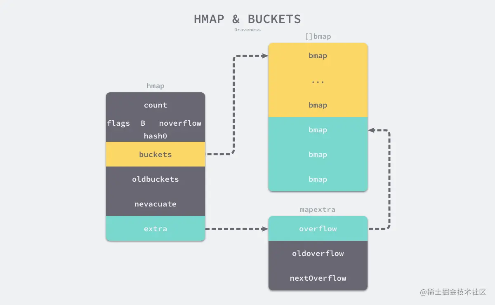
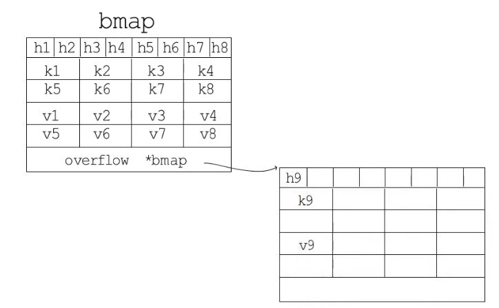

数据结构
===

## String

- 字符串可以为empty，不可以为nil。
- 字符串是不可以修改的，值不可变。
- 字符串的本质是字符数组，每个字符在存储时对应一个或者多个整数（根据编码方式决定）

```go
type stringStruct struct{
    str unsafe.Pointer
    len int
}
```

- string类型的底层是一个指向byte类型的切片。
- 这里的len是字符串中字节的个数，而不是字符的个数。
- 从这里可以看出string类型定义没有容量Cap，所以字符串类型**不能被扩容**，实际上的拼接、追加是通过**拷贝**实现的。

```go
str := "hello"
str = "Goland"

str[0] = "I" // error
```

- 实际中我们使用的是重新赋值，而不是修改。
- 每个字符在存储时对应一个整数，我们将一个字符赋值给byte类型是不允许的。

```go
str = "Hello world"
strbyte = [72 101 108 108 111 32 119 111 114 108 100]
string(strbyte) = "Hello world"
```

- 实际中我们可以将string类型转换为[]byte，但是注意转换后是一个拷贝，对源字符串没有影响。

---

[]byte转string：

- 新申请内存空间，构建内存地址为addr，长度为len
- 构建string对象，指针地址为addr，len字段为len
- 将切片数值内容拷贝到string所指的内存空间当中

> []byte转string，在某个场景下，临时转换时，不会发生内存拷贝。

string转[]byte：

- 新申请切片内存空间
- 将string中指针执行内存区域的内容拷贝到新切片当中

---

```go
str1 := "goland"

json := `{"hello", "goland", "name": ["zhangsan"]}`
```

- 使用双引号时，遇到部分特殊符号需要使用转移字符
- 使用反引号，可以在复杂场景当中保证原始内容

---

由于Go中string不能拷贝，发生拼接时会发生内存的拷贝，存在性能损耗。

常见的拼接包括了：

- +操作符
- fmt.Sprintf（一般用于字符串的格式化）
- bytes.Buffer
- strings.Builder
- append(性能较好，一般用这个)

## Slice

Q：Slice和数组的区别，Slice的扩容方式

Slice可以理解动态数组，数据扩容，是一种引用类型（值拷贝，是拷贝整个指针结构体的内容）

支持自动扩容，长度可变，申明时不需要指针大小。

---

```go
type stringStruct struct{
    str unsafe.Pointer // 指针变量，指向一块连续的内存空间
    len int
    cap int
}
```

可以类比到上面的string的底层，多了一个cap，支持扩容。

在初始化时，如果没有指定cap，那么cap和len相等。

---

在截取切片时，指向同一个底层数据，所以注意更新切片时，可能改变原切片的值。

在对切片进行复制时，复制后的切片和原来的切片指向同一块内存区域。但是数组赋值是创建新的内存区域。

> 这里的复制是复制了上述的结构体（重要的是其中的指针）。

---

追加元素不足时，slice会自动扩容

1.17之前：

1. 如果新的容量 >= 原容量的两倍，就使用新的容量大小
1. 否则，看切片容量小于1024，就扩展为原容量的两倍
1. 若大于1024，就会反复在原切片容量上增加1/4，直到新容量大于等于需要的容量。
1. 进行一个内存对其

1.17以后：

1. 如果新的容量 >= 原容量的两倍，就使用新的容量大小
2. 否则，看切片容量小于256，就扩展为原容量的两倍
3. 若大于等于256，就会根据公式扩容，直到新容量大于等于需要的容量。
4. 进行一个内存对齐

---

为了使得赋值后的数组互不干扰，应该使用copy函数。

```go
temp := make([]int, len(cur)) // 注意len
copy(temp, cur)
```

## Map

为了实现一个性能优异的哈希表，需要关注两个关键点。

- 哈希函数的选择：选择的好，使得哈希函数的结果分布尽可能均匀，从而减少哈希冲突。
- 哈希冲突的解决：当输入的键足够多，容易发生冲突，常见的解决办法：开放寻址法和拉链法。
- 计算索引位置：根据hash函数将key转换为一个hash值，用hash值对所有的桶数取模得到一个索引值。


### 开放地址法

- 当我们向当前哈希表写入新的数据时，如果发生了冲突，就会将键值对写入到下一个索引不为空的位置。
- 开放寻址法中对性能影响最大的是**装载因子**，它是数组中元素的数量与数组大小的比值。
  - 随着装载因子的增加，线性探测的平均用时就会逐渐增加，这会影响哈希表的读写性能。
  - 当装载率超过 70% 之后，哈希表的性能就会急剧下降，而一旦装载率达到 100%，整个哈希表就会完全失效，这时查找和插入任意元素的时间复杂度都是 𝑂(𝑛)。
- 使用开放寻址法来实现哈希表，那么实现哈希表底层的数据结构就是数组，不过因为数组的长度有限。

### 拉链法

拉链法是哈希表最常见的实现方法，大多数的编程语言都用拉链法实现哈希表，它的实现比较开放地址法稍微复杂一些，但是平均查找的长度也比较短，各个用于存储节点的内存都是动态申请的，可以节省比较多的存储空间。

- 找到键相同的键值对 — 更新键对应的值；
- 没有找到键相同的键值对 — 在链表的末尾追加新的键值对；

### 数据结构

go语言的map其实是一个指向hmap的指针，占用8个字节。



- `count` 表示已经存储的键值对数目
- `flags`标记map的一些的状态
- `noverflow`溢出桶的数量的近似值
- `B` 表示当前哈希表持有的 `buckets` 数量，2^B个
- `hash0` 是哈希的种子，它能为哈希函数的结果引入随机性
- `bucket`记录桶在哪里
-  `oldbuckets` 记录扩容阶段，旧桶在哪里
-  `nevacuate`记录即将迁移的旧桶编号

> 渐进式扩容，内容避免一次性扩容带来的瞬时抖动问题。

当B > 4即桶的个数大于2^4，认为发生溢出的概率比较大，会预先分配2^(B-4)个桶，并且这些桶和普通桶是连续分配的，后面作为溢出桶。

- `extra`记录已使用的溢出桶地址，旧桶使用的溢出桶地址，下一个空闲溢出桶地址。



hmap中包含了多个结构为bmap的bucket数组，底层采用链表结构将bmap连接起来，处理冲突使用了优化的拉链法。

- 每个bmap可以存放八对键值对。
- 前面八个是不同键的哈希的高 8 位，可以快读确认该键所在的哈希桶位置，直接访问桶，减少访问键值对次数以提高性能。


### 访问原理

对于`v:=map[key]`这种方式，大体步骤是

- 判断map是否为空或者无数据，若为空返回无数据或者对应的控制
- map写检测，如果正在处于写状态，表示此时不能进行读取，panic
- 计算出hash值和掩码
- 判断当前map是否处于扩容状态，如果扩容
  - 根据状态位判断当前桶是否被迁移，去新旧桶查找
  - 根据地址掩码找到对应位置
- 依次遍历桶以及溢出桶来查找key
  - 遍历桶内的8个槽位
  - 比较该槽位的tophash值和当前key的是否相等
    - 相等，继续比较key是否相等，相等返回对应的value
    - 否则，判断这个槽位是否后继为空
      - 是说明，不在后续的桶，不存在，返回零值
      - 是，遍历下一个槽位
- 当前桶没有找到，遍历溢出桶，同样方式查找

### 赋值原理

`map[key]=value`形式，如果存在key更新value，如果不存在则插入新的键值对。

> 对map进行赋值操作时，需要初始化，否则会panic，注意var只是声明。

map是**非线程安全的**，当有其他线程正在读写map时，执行map的赋值会报并发读写错误。

大致流程：

- map写检测，如果正在处于写状态，表示此时不能进行读取，报panic
- 计算出hash值，将map置为写状态
- 判断桶数组是否为空，为空，初始化桶数组
- 目标桶查找
  - 根据hash值找到桶的位置
  - 判断桶是否处于扩容状态，若正在扩容，迁移这个桶，还要帮忙多迁移一个桶以及它的溢出桶（迁移进度指向的桶）
  - 获取目标桶的指针，计算出tophash，开始后面的key查找过程
- key查找，遍历桶和溢出桶每个槽位
  - 判断槽位的tophash和目标的tophash
  - 不相等
    - 槽位tophash为空，标记这个位置为候选位置
    - 槽位的tophash标位置为后继为空，直接插入key/value
    - 不为空，继续遍历下一个槽
  - 相等
    - 判断当前槽位的key与目标key是否相等
      - 不相等，继续遍历下一个位置
      - 相等，找到目标key的位置，存在就更新值，跳到收尾操作
- key插入
  - 若map中没有找到key，且这个桶和溢出桶都没有槽位了，申请一个溢出桶，并插入
  - 否则找到的位置插入
- 收尾
  - 再次判断map的写状态
  - 清楚map写状态

### 扩容原理

随着元素不断插入，会导致map的数据量增加，hash性能变差，溢出桶增加，因此需要更多的桶和内存来保证哈希的读写性能，所以map会自动触发扩容。

以下两种情况会触发扩容：

- map的负载因子超过6.5：双倍扩容
- 溢出桶数量过多：等量扩容（溢出桶数量接近正常桶数量）

> 扩容需要判断当前是否为扩容状态，避免二次扩容冲突。
>
> 经过测试6.5时数组桶快要用完的情况，存在溢出要去遍历溢出桶，所以需要扩容。
>
> 删除过多元素时，负载因子减小，再插入很多元素会创建更多的溢出桶，导致查找元素时去遍历查过的溢出桶链表，因此选择扩容，把之前的数组桶和溢出桶中元素重排。

整个过程：

- map扩容采取了渐进式扩容，避免性能的影响，遵循写时赋值，每次只对使用到的数据进行迁移。
- 扩容发生在赋值操作时，满足上述两个条件触发。

迁移时机：

- 判断当前bucket是否已经迁移，没有迁移就做迁移操作，通过tophash的第一个hash值判断
- 数据迁移时，可能到大小相同的桶，就依然存放在原先的位置，如果是双倍扩容，会发生变化
- 确定完bucket后，按照bucket键值对进行迁移

### 删除原理

和访问原理差不多，会进行写检测，寻找bucket和key过程

从delete map单个key/value的原理可以看出，当我们删除一个键值对的时候，这个键值对在桶中的
内存并不会被释放，所以对与map的频繁写入和删除可能会造成内存泄漏。

### 遍历原理

每次遍历的数据顺序不同，随机一个桶以及桶内的起点槽下标，遍历时从这个桶开始，在遍历每个桶时都从这个槽开始。

why：

- 一方面：因为go的扩容不是一个原子操作，是渐进式的，所以在遍历map的时候，可能发生扩容，一旦发生扩容，key的位置就发生了重大的变化，下次遍历map的时候结果就不可能按原来的顺序了。
- 另一方面：hash表中数据每次插入的位置是变化的，同一个map变量内，数据删除再添加的位置也有可能变化，因为在同一个桶及溢出链表中数据的位置不分先后。

主要步骤，先初始化迭代器：

- 判断map是否为空
- 保存map的B值和当前桶指针，即保存遍历开始时map的数据快照，避免扩容时map的B值和桶指针发生改变
- 随机一个开始遍历的起始桶下标
- 随机一个槽位下标，后续每个桶内的遍历都从这个槽位开始
- 把map置为遍历状态
- 开始执行一次遍历过程

---

- map的并发写检测，判断map是否处于并发写状态，是则panic
- 判断是否已经遍历完了，遍历完了直接退出
- 开始遍历
- 首选确定一个随机开始遍历的起始桶下标作为startBucket,然后确定一个随机的槽位下标作为offset
- 根据startBucket和offset开始遍历当前桶和当前桶的谥出桶，如果当前桶正在扩容，则进行步骤6,否则进行步骤7
- 在遍历处于扩容状态的bucket的时候，因为当前bucketi正在扩容，我们并不会遍历这个桶，而是会找到这个桶的I旧桶old_bucket,遍历l旧桶中的一部分key,这些key重新hash计算后能够散列到bucketr中，对那些key经过重新hash计算不散列到bucket中的key,则跳过
- 根据遍历初始化的时候选定的随机槽位开始遍历桶内的各个key/value
- 继续遍历bucket溢出指针指向的溢出链表中的溢出桶
- 假如遍历到了起始桶startBucket,则说明遍历完了，结束遍历
