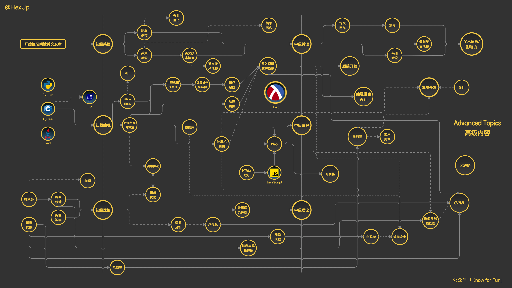

Do sth for fun
===

## 计算机基础

### 前言

- [计算机教育中缺失的一课](https://missing-semester-cn.github.io/)

- [写一份简历](https://www.mujicv.com/)

### 编程语言 

**C ++**

✅黑马程序员C++课

✅C++ primer 第五版

✅Effective C++

✅侯捷《C++面向对象高级编程》

⬜侯捷《C++STL》

⬜侯捷《C++11》

⬜侯捷《内存管理与分析》

**Go**

### 计算机网络

⬜小林图解网络

⬜计算机网络：自顶向下方法

⬜TCP/IP详解

### 数据结构

✅大话数据结构

✅代码随想录

✅codetop

✅[有没有人一起刷LC](https://leetcode.cn/circle/article/48kq9d/)

### 操作系统

⬜现代操作系统

⬜CSAPP

⬜MIT6.S081

### 数据库

⬜MySql必知必会

⬜牛客网刷题

⬜MySql45讲

⬜B站编程技术宇宙讲Redis

⬜黑马程序员Redis

### 设计模式

- 熟悉单例、工厂，了解观察者、策略、模板方法等

### 编译原理

⬜龙书

---

### 分布式系统管理

⬜MIT6.824

---

## 后端常用技术

### Web框架

### 数据存储

⬜Redis

⬜SQL/NoSQL

### Restful API

### 常用工具

⬜Docker / Grafana...

⬜cmake / makefile

⬜Linux常见命令

⬜GDB常见命令

⬜Git常见命令

> 如何理解需求，用工具实现。

## 项目准备

### 常见内容

| 项目名                                                       | 关键词 |
| ------------------------------------------------------------ | ------ |
| [TinyWebServer](https://github.com/qinguoyi/TinyWebServer)   |        |
| [JSON](https://github.com/miloyip/json-tutorial)             |        |
| [TinySTL](https://github.com/Alinshans/MyTinySTL)            |        |
| [KV存储仓库](https://15445.courses.cs.cmu.edu/fall2022/project0/) |        |
|                                                              |        |
|                                                              |        |
|                                                              |        |

- 与造轮子相关，结合应用领域，如即时通讯/游戏。
- C++后端方向也有一些开发框架值得学习，比如：百度开源的 brpc 和文档（值得一看），seastar 框架，搜狗的 workflow ，你可以重点去看他们的设计思想以及学习如何使用。

###  参与开源

- [开源总结](https://erdengk.github.io/gsoc-analyse/)

- [开源之夏](https://summer-ospp.ac.cn/help/)
