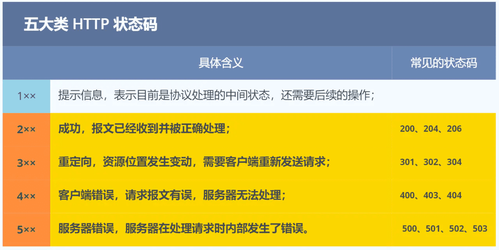
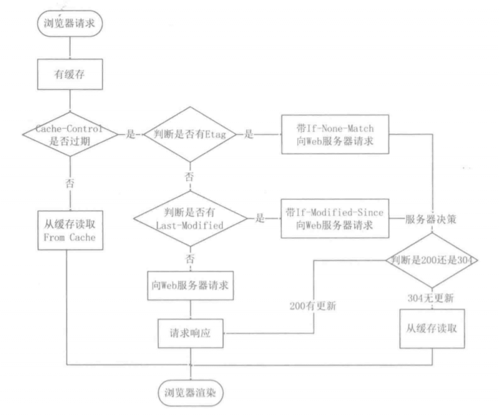

HTTP常见的问题
===

## 是什么

HTTP 是超文本传输协议，也就是HyperText Transfer Protocol。

可以拆分成三部分：

- 超文本：现如今的「超文本」，包括了图片、文字、视频等，最关键还有超链接。
- 传输：HTTP 是一个在计算机世界里专门用来在两点之间传输数据的约定和规范，两点之间有任意的中继。
- 协议：HTTP 是一个用在计算机世界里的协议。它使用计算机能够理解的语言确立了一种计算机之间交流通信的规范（两个以上的参与者），以及相关的各种控制和错误处理方式（行为约定和规范）。

**HTTP 是一个在计算机世界里专门在「两点」之间「传输」文字、图片、音频、视频等「超文本」数据的「约定和规范」。**

### 常见的状态码

### 常见字段

- connection中的`keep-live`和TCP中的`keepalive`的区别

## GET和POST

### GET

- 一般GET 的语义是从服务器获取指定的资源，包括文本、视频、页面等多个资源
- GET一般写在url中，浏览器会对url的长度有限制
- 一般情况下，安全和幂等关系，是否可以缓存

### POST

- POST 的语义是根据请求负荷（报文body）对指定的资源做出处理。
- POST 请求携带数据的位置一般是写在报文 body 中，body 中的数据可以是任意格式的数据，只要客户端与服务端协商好即可，而且浏览器不会对 body 大小做限制。

### 对比

- 一般情况下，安全和幂等关系，是否可以缓存
  - 安全：不会破坏服务器资源
  - 幂等：多次执行相同的操作，结果都是相同的
  - 因此一般情况下，GET方法只读所以是安全和幂等的，POST方法会提交和修改数据是不安全和不幂等的。
  - 实际中GET方法用于新增和修改数据就可能是不安全不幂等的，同理POST请求也是。
- GET请求可以带上body吗
  - 任何请求都可以用上body，只是GET请求获取资源用不上body
  - 同理，URL查询不是GET独有的，POST请求中URL也有参数

## 缓存原理

对重复性的HTTP请求，每次得到数据都一样，把[请求 + 缓存]放在本地，下次直接读取本地数据。

HTTP 协议的头部有不少是针对缓存的字段，实现缓存技术都要用到`Cache-control`和`expires`来判断缓存的过期情况。、

在第一次发送请求报文后，服务器在响应报文当中标注了`cache-control`，当报文过期后，向服务器发送请求时，会更新`cache-control`。

### 强制缓存

浏览器判断缓存有没有过期，没有过期会直接使用本地缓存，决定权在浏览器。

- 强缓存是利用了`Cache-Control`相对时间和`Expires`相对时间来判断资源在客户端的有效期
- 如果 HTTP 响应头部同时有 Cache-Control 和 Expires 字段的话，**Cache-Control 的优先级高于 Expires** 

### 协商缓存

浏览器判断过期的报文是否发生变更，通过本地缓存当中的`Last-Modified`和`ETag`两种标签判断。如果没有变更，会发送`304`报文告知客户端可以使用本地缓存，否则返回200有更新返回最新的资源，同时更新的标签值。

### 为什么ETag与优先级更高

## HTTP特性
