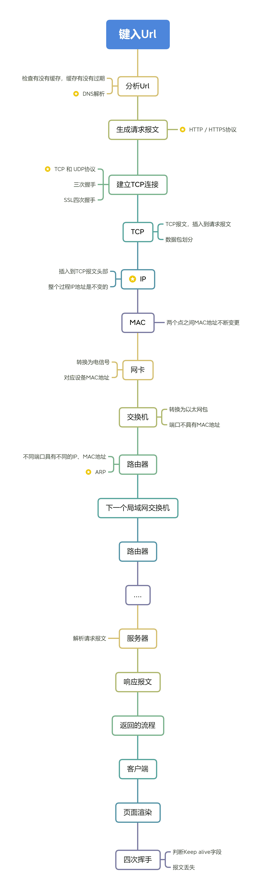
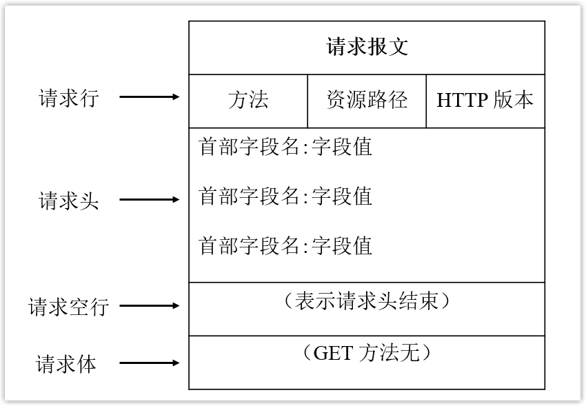
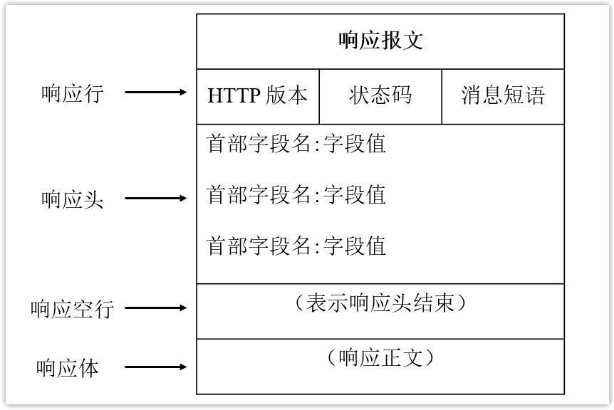

键入网址到网页显示，期间发生了什么？
===

## URL解析

浏览器首先对 URL 解析，解析出协议、域名、端口、资源路径、参数等。

比如对`https://xiaolincoding.com/network/1_.html`

> 1. https表示访问的数据的协议
> 2. xiaolincoding.com服务器名称
> 3. 后续是文件的路径名，当省略路径名时访问默认网页，一般是index.html

## HTTP缓存

浏览器为了提升性能，在 URL 解析之后，实际会先查询是否有缓存，如果缓存命中，则直接返回缓存资源。

## DNS解析

DNS其实相当于一个数据库，映射着对应域名到对应的IP地址，域名较于IP地址更好记忆。

> - 一个域名的，从左到右的层次关系
>
> - 整个域名解析过程，也有响应的缓存

## HTTP请求

建立可靠连接后，进行数据通信过程，根据URL解析得到的文件名和DNS解析得到的服务器IP地址，浏览器生成并向服务器发送一个HTTP请求报文。

## TCP三次握手

向服务器发起TCP连接，**保证双方都有发送和接收的能力**。

> - 这里复习三次握手的过程。
> - 如果是HTTPS 协议，在建立 TCP 连接之后，还需要进行 SSL/TLS 握手过程，以协商出一个会话密钥，用于消息加密，提升安全性。

## 协议栈

### 可靠传输—TCP

> - TCP报文的大体格式。
> - 数据包过长是如何分割的，为什么在这一层分割，不是在IP层。

在处理完后，TCP报文包含了TCP头部 + 浏览器生成的HTTP请求报文（头部 + 数据）。

### 远程定位—IP

> - IP报文的大体格式
>   - TCP报文中填写了端口号，IP协议中要填写源地址和目标地址。
>   - HTTP经过TCP传输，在IP包头的协议号要填写`06`，表示协议为TCP。
> - 多张网卡，根据路由表匹配合适的源地址。

经过封装后IP报文，在TCP报文基础上，添加了IP头部。借此知道了出发的目的地和终点站。

在整个过程中IP地址不会变更，ARP协议通过IP地址查找主机或者路由器的MAC地址。

### 两点传输—MAC

生成IP报文后，还要加上MAC头部，用于两点之间的传输。

关于MAC地址，疑问比较大。

- 整体流程
  - 一开始填写的MAC地址就是本机MAC地址，以及本局域网的**默认网关**的MAC地址。
  - 先去查ARP高速缓存：本局域网网下各主机和路由器的IP地址和目的地址之间映射关系
  - 缓存未中，通过ARP协议发起硬件广播，更新路由表。
- MAC地址在两点设备转发过程中不断变更，IP地址是自始至终不变的量。

> 这里我理解先转发到默认网关，便于进一步转发。
>
> 一开始可能也不知道目标主机的MAC地址。

## 硬件传输

### 出口—网卡

通过上述封装后的网络包，是一连串的二进制数字信息，必须转换为电信号才能在网线上传输，负责这一部分操作的是网卡，控制网卡的是网卡驱动程序。

网卡驱动获取网络包之后，会将其**复制**到网卡内的缓存区中，接着会在其**开头加上报头和起始帧分界符，在末尾加上用于检测错误的帧校验序列**。

### 送别者—交换机

- 交换机收到电信号后，将其转换为数字信号，并将得到的网络包中，将其MAC地址和使用的端口号写到其路由表当中，在后续收到其他端口发来的网络包时，发现目的MAC地址就在路由表中，直接进行转发。

- 交换机**没有MAC地址**，会接受所有的发送过来的包到缓冲区，去路由表查询接收方的MAC地址。
- 如果路由表中没有接收方的信息，说明没有收到过其发送的网络包
  - 交换机会将其转发到除了源端口号所有的端口。
  - 只有目标设备会接受，其他的会进行丢弃，在响应后，交换机路由表会更新路由表。
  - 此外如果地址本来就是广播地址，也会进行除了源端口之外的所有端口转发。

> 交换机的作用是什么

### 出境大门—路由器

网络包经过交换机之后，现在到达了**路由器**，通过查表转发到下一个路由器或目标设备。

路由器每个端口都有IP地址和MAC地址，因此根据端口MAC地址接受发送给自己的以太网包，再查询路由表转发目标，再由响应端口发送以太网包出去。

> 查询不到对应的MAC地址，进行ARP，并且路由器具有ARP缓存。
>
> 完成后转换为电信号，通过端口发送出去，类似计算机。
>
> 通过交换机达到下一个路由器，交换机根据接收方MAC地址（下一个路由器的）

- 路由器可以起到划分子网的作用

## 响应HTTP请求

服务器收到请求报文后，处理返回响应报文给浏览器。

比如`HTTP/1.1 200 OK`，200是状态码，OK是消息短语。

## 页面渲染

浏览器收到服务器的响应报文后，从响应中得到响应资源，进行页面渲染。

## TCP四次挥手

当数据完成请求到返回的过程之后，根据请求/相应头中 Connection 的 `Keep-Alive` 属性可以选择是否断开 TCP 连接，如果不需要再进行数据通信，即可以关闭连接，此时则会发生四次挥手行为。

