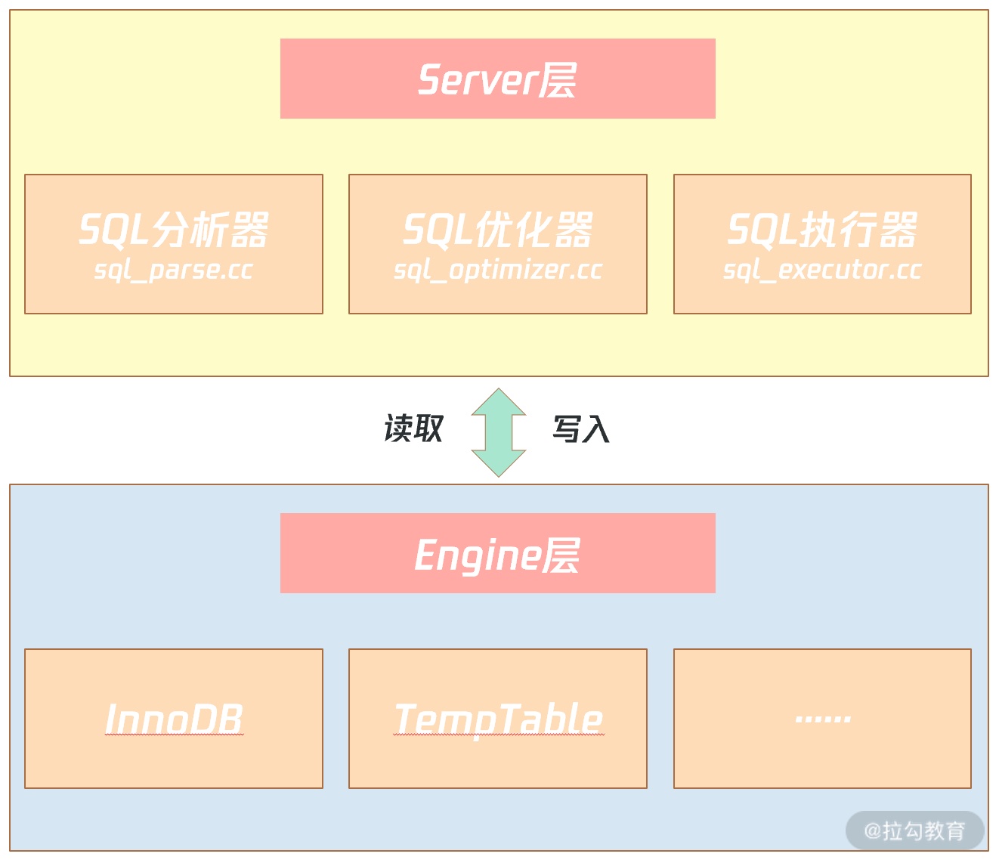

索引
===

**索引是提升查询速度的一种数据结构。**

> 索引之所以能提升查询速度，在于它在插入时对数据进行了排序，比如聚簇索引根据主键排序。
>
> 同时也会影响插入或者更新的性能，需要考虑顺序。

使用索引带来以下的好处

- 主键索引是默认创建的，其他索引称为二级索引
- 整个数据库中，数据表的查询速度直线提升，数据量越大时效果越明显。
- 通过创建唯一索引，可以确保数据表中的数据唯一性，无需额外建立唯一约束。
- 在使用分组和排序时，同样可以显著减少`SQL`查询的分组和排序的时间。
- 连表查询时，基于主外键字段上建立索引，可以带来十分明显的性能提升。
- 索引默认是`B+Tree`有序结构，基于索引字段做范围查询时，效率会明显提高。
- 从`MySQL`整体架构而言，减少了查询`SQL`的执行时间，提高了数据库整体吞吐量。

同时也会带来一系列弊端：

- 建立索引会生成本地磁盘文件，需要额外的空间存储索引数据，磁盘占用率会变高。
- 写入数据时，需要额外维护索引结构，增、删、改数据时，都需要额外操作索引。
- 写入数据时维护索引需要额外的时间开销，执行写`SQL`时效率会降低，性能会下降。

## 数据结构

### 什么样数据结构是好的

MySQL 的数据是持久化的，意味着数据（索引+记录）是保存到磁盘上的，因为这样即使设备断电了，数据也不会丢失。

但是通过索引查询某行数据时，先读取索引到内存，再根据索引从磁盘中找到某行数据读到内存当中，这样会发生多次磁盘IO操作，效率和损耗时间都是巨大的。

- **好的数据结构应该能在尽可能少的磁盘的 I/O 操作中完成查询工作；**

MySQL 是支持范围查找的，所以索引的数据结构不仅要能高效地查询某一个记录，而且也要能高效地执行范围查找。

- **要能高效地查询某一个记录，也要能高效地执行范围查找；**

### 二分搜索树

由于索引数据一般是按顺序排列的，可以使用二分查找法定位数据。时间复杂度 O(logn)。

由此有了非线性且天然适合二分查找的数据结构，二叉查找树。

二叉查找树不仅解决了查找问题，在插入新元素时能够保持二分结构，并且开销较小。

但是二叉查找树存在一个极端情况，当每次插入的元素都是最大的元素，会形成一个链表结构，查找数据的时间复杂度变成了O(n)。

由于树是存储在磁盘中，访问每个节点，都对应一次磁盘 I/O 操作（*假设一个节点的大小「小于」操作系统的最小读写单位块的大小*），也就是说**树的高度就等于每次查询数据时磁盘 IO 操作的次数**，所以树的高度越高，就会影响查询性能。

### 平衡二叉搜索树

为了解决上述极端情况，提出了平衡二叉搜索树，**每个节点的左子树和右子树的高度差不能超过 1**。

但是随着插入的数据增多，会导致树的高度增加，从而增加磁盘IO的次数。

根本原因是，二叉树每个节点只能保存2个节点。

由此想到把二叉树改成M叉树，当树的节点越多的时候，并且树的分叉数 M 越大的时候，M 叉树的高度会远小于二叉树的高度。

### B树

为了解决上述树高度问题，提出了B树，它不再限制一个节点就只能有 2 个子节点，而是允许 M 个子节点 (M>2)，从而降低树的高度。

B 树的每一个节点最多可以包括 M 个子节点，M 称为 B 树的阶，所以 B 树就是一个多叉树。

假设 M = 3，那么就是一棵 3 阶的 B 树，特点就是每个节点最多有 2 个（M-1个）数据和最多有 3 个（M个）子节点，超过这些要求的话，就会分裂节点。

但是B树每个节点存放了索引和记录，用户的记录数据的大小很有可能远远超过了索引数据，这就需要花费更多的磁盘 I/O 操作次数来读到「有用的索引数据」。

在查询底层节点数据时，加载过多中间无用数据，会浪费资源。

### B+树

由此又提出了B+树，叶子节点存放真实数据，非叶子节点存放索引信息。叶子节点之间又构成有序链表。

### B+与B树对比

- 单点查询上
  - B树节点包含了记录，最快可以O1查询，但是有时候需要访问叶子节点才能找到，波动较大。
  - B+树较矮，能用较少的次数查询到数据，但是需要查询到对应叶子节点。
- 插入和删除
  - B+ 树有大量的冗余节点，这样使得删除一个节点的时候，可以直接从叶子节点中删除，甚至可以不动非叶子节点，效率高
  - B树删除需要复杂的树变化
- 范围查询
  - B+树底层是有序链表，就可以进行范围查询，省去重复查询。
  - B树需要多次IO查询。

## InnoDB中B+树索引

是目前为止排序**最有效率**的数据结构。像二叉树，哈希索引、红黑树、SkipList，在海量数据基于磁盘存储效率方面远不如 B+ 树索引高效。

上面几种一般用于内存对象，基于磁盘的数据排序与存储，最有效的还是B+树索引。

**B+树索引的特点是：** 基于磁盘的平衡树，但树非常矮，通常为 3~4 层，能存放千万到上亿的排序数据。**树矮意味着访问效率高，从千万或上亿数据里查询一条数据，只用 3、4 次 I/O**。

> 实际中只有叶子节点存放的是数据页，其他是目录页，3~4层已经能存放大量的数据。

> 所有 B+ 树都是从高度为 1 的树开始，然后根据数据的插入，慢慢增加树的高度。

### B+树查询性能

---

**见书中第五六章**

---

### 优化B+树索引的插入性能

B+ 树在插入时就对要对数据进行排序，但排序的开销其实并没有你想象得那么大，因为排序是 CPU 操作（当前一个时钟周期 CPU 能处理上亿指令）。

**真正的开销在于 B+ 树索引的维护，保证数据排序，这里存在两种不同数据类型的插入情况**。

- **数据顺序（或逆序）插入：** B+ 树索引的维护代价非常小，叶子节点都是从左往右进行插入，比较典型的是自增 ID 的插入、时间的插入（若在自增 ID 上创建索引，时间列上创建索引，则 B+ 树插入通常是比较快的）。
- **数据无序插入：** B+ 树为了维护排序，需要对页进行分裂、旋转等开销较大的操作，另外，即便对于固态硬盘，随机写的性能也不如顺序写，所以磁盘性能也会收到较大影响。比较典型的是用户昵称，每个用户注册时，昵称是随意取的，若在昵称上创建索引，插入是无序的，索引维护需要的开销会比较大。

对于 B+ 树索引，在 MySQL 数据库设计中，仅要求主键的索引设计为顺序，比如使用自增。

在表结构设计时，主键的设计一定要尽可能地**使用顺序值**，这样才能保证在海量并发业务场景下的性能。

实际中对于索引的数量没有限定，但是对于创建的N多索引，在实际中可能没有使用过，优化器并不会选择这些低效的索引，这些**无效索引占用了空间，又影响了插入的性能**。

实际可以查看哪些索引未被使用过，DBA考虑删除这些没有用过的索引。

MySQL 8.0 版本推出了索引不可见（Invisible）功能。在删除废弃索引前，用户可以将索引设置为对优化器不可见，然后观察业务是否有影响。若无，DBA 可以更安心地删除这些索引。

## 索引组织表

### 是什么

数据存储有堆表和索引组织表两种方式。

堆表中数据是**无序**存放，数据的排序完全依赖于索引。数据和索引也是分开存储的，索引是排序后的数据，而堆表中的数据是无序的。

索引的叶子节点存放了数据在堆表中的地址，当堆表的数据发生改变，且位置发生了变更，所有索引中的地址都要更新，十分影响性能。

**索引组织表，数据根据主键排序存放在索引中**，主键索引也叫聚集索引（Clustered Index）。在索引组织表中，数据即索引，索引即数据。

之前的User表中主键是id，表中的数据根据id排序存储，叶子节点存放了完整的记录。表就是索引，索引就是表。

### 二级索引

除了主键索引以外，其他的索引都是二级索引或者非聚集索引。

与主键索引不同，叶子节点存放的是索引键值、主键值，只有聚集索引（主键索引）才会存放完整的数据。

索引组织表的二级索引方式，若记录改变，只需要维护主键索引中的完整记录，除非记录的主键发生变化的。

> 在二级索引中主要有两步骤，先去二级索引中找到对应的主键，再回主键索引中查找完整的。

### 函数索引

函数索引的含义是，索引键是一个函数表达式。主要用来：

- 优化业务SQL性能

```sql
ALTER TABLE User 

ADD INDEX #向现有表中添加索引

idx_func_register_date((DATE_FORMAT(register_date,'%Y-%m'))); # 在格式化后的数据创建索引
```

```sql
EXPLAIN SELECT * FROM User 

WHERE DATE_FORMAT(register_date,'%Y-%m') = '2021-01'
```

只有主动创建了格式化索引，在查询时才能用到。

- 配合虚拟列

```sql
CREATE TABLE UserLogin (

    userId BIGINT,

    loginInfo JSON,

    cellphone VARCHAR(255) AS (loginInfo->>"$.cellphone"),

    PRIMARY KEY(userId),

    UNIQUE KEY idx_cellphone(cellphone)

);
```

cellphone 就是一个虚拟列，它是由后面的函数表达式计算而成，本身这个列不占用任何的存储空间，而索引 idx_cellphone 实质是一个函数索引。

## 组合索引

组合索引（Compound Index）是指由多个列所组合而成的 B+树索引，对多个列进行排序。

对组合索引（a，b）来说，实际上是分别基于a，b建立了一个联合索引，越靠左优先级越高。

因为其对列 a、b 做了排序，WHERE 后查询列 a 和 b 的顺序无关，即使先写 b = ? AND a = ？依然可以使用组合索引（a，b）。 但是单独对b不能使用（a, b）索引，必须包含了最左的字段，才能使用联合索引。

根据顺序（a，b），所以对下列SQL使用组合索引，

```sql
SELECT * FROM table WHERE a = ？ ORDER BY b DESC
```

索引（a，b）排序不能得出（b，a）排序，因此下面的 SQL 无法使用组合索引（a，b），注意**索引失效**问题

```sql
SELECT * FROM table WHERE b = ？ ORDER BY a DESC
```

当所查询的字段就在二级索引的叶子节点当中，则可直接返回结果，**避免**回表。

## 索引失效

InnoDB 和 MyISAM 都支持 B+ 树索引，但是它们数据的存储结构实现方式不同。不同之处在于：

- InnoDB 存储引擎：B+ 树索引的叶子节点保存数据本身；
- MyISAM 存储引擎：B+ 树索引的叶子节点保存数据的物理地址；

所谓索引失效指的是，查询条件用上了索引列，实际中可能会发生全表扫描，而没有使用索引。

### 对索引使用左或者左右模糊匹配

当我们使用左或者左右模糊匹配的时候，也就是 `like %xx` 或者 `like %xx%` 这两种方式都会造成索引失效。

使用右模糊匹配，依然会走索引匹配。

为什么 like 关键字左或者左右模糊匹配无法走索引呢？

> 因为索引 B+ 树是按照「索引值」有序排列存储的，只能根据前缀进行比较。

### 对索引使用函数

查询条件中对索引字段使用函数，就会导致索引失效。比如`select * from t_user where length(name)=6;`

为什么对索引使用函数，就无法走索引了呢？

> 因为索引保存的是索引字段的原始值，而不是经过函数计算后的值，自然就没办法走索引了。

> MySQL8.0开始支持对经过函数计算过的值，建立一个索引。

###  对索引进行表达式计算

在查询条件中对索引进行表达式计算，也是无法走索引的。比如`explain select * from t_user where id + 1 = 10;`

为什么？

> 类似对索引使用函数，索引保存的是索引字段的原始值，而不是id + 1计算后的值。
>
> 但是对 where id = 10 -1这种是可以的。

### 对索引隐式类型转换

索引字段是字符串类型，但是在条件查询中，输入的参数是整型的话，你会在执行计划的结果发现这条语句会走全表扫描。

但是如果索引字段是整型类型，查询条件中的输入参数即使是字符串，是不会导致索引失效，还是可以走索引扫描。

> 用字符串类型查整型类型√，用整型查字符串类型×
>
> 简单理解用整型查字符串类型时，转换为字符串进行比较时可能出错。
>
> “10” ---> 10 > 9 √
>
> 10    ---> "10"  < "9"，因为第一位是"1"
>
> 由于隐式类型转换是通过 CAST 函数实现的，等同于对索引列使用了函数，所以就会导致索引失效。

### 联合索引非最左匹配

联合索引要能正确使用需要遵循最左匹配原则，也就是按照最左优先的方式进行索引的匹配。在联合索引的情况下，数据是按照索引第一列排序，**第一列数据相同时才会按照第二列排序**。

比如，如果创建了一个 (a, b, c) 联合索引，如果查询条件是以下这几种，因为不符合最左匹配原则，所以就无法匹配上联合索引，联合索引就会失效:

- where b=2；
- where c=3；
- where b=2 and c=3；

`MySQL`的最左前缀原则，在匹配到范围查询时会停止匹配，比如`>、<、between、like`这类范围条件，并不会继续使用联合索引

---

有一个比较特殊的查询条件：where a = 1 and c = 3 ，符合最左匹配吗？

这种其实严格意义上来说是属于索引截断，不同版本处理方式也不一样。

MySQL 5.5 的话，前面 a 会走索引，在联合索引找到主键值后，开始回表，到主键索引读取数据行，Server 层从存储引擎层获取到数据行后，然后在 Server 层再比对 c 字段的值。

从 MySQL 5.6 之后，有一个**索引下推功能**，可以在存储引擎层进行索引遍历过程中，对索引中包含的字段先做判断，直接过滤掉不满足条件的记录，再返还给 Server 层，从而减少回表次数。

> 索引下推的大概原理是：截断的字段不会在 Server 层进行条件判断，而是会被下推到「存储引擎层」进行条件判断（因为 c 字段的值是在 `(a, b, c)` 联合索引里的），然后过滤出符合条件的数据后再返回给 Server 层。由于在引擎层就过滤掉大量的数据，无需再回表读取数据来进行判断，减少回表次数，从而提升了性能。

### WHERE 子句中的 OR

在 WHERE 子句中，如果在 OR 前的条件列是索引列，而在 OR 后的条件列不是索引列，那么索引会失效。

只有一个是索引列，是没有意义的。

## 索引出错

### MySQL如何选择索引的

索引的选择取决于数据库的优化器。优化器的选择是基于成本（cost），哪个索引的成本越低，优先使用哪个索引。

如图所示，MySQL 数据库由 Server 层和 Engine 层组成：



- Server 层有 SQL 分析器、SQL优化器、SQL 执行器，用于负责 SQL 语句的具体执行过程；
- Engine 层负责存储具体的数据，如最常使用的 InnoDB 存储引擎，还有用于在内存中存储临时结果集的 TempTable 引擎。

SQL 优化器会分析所有可能的执行计划，选择成本最低的执行，这种优化器称之为：CBO（Cost-based Optimizer，基于成本的优化器）。

在 MySQL中，一条 SQL 的计算成本计算如下所示：`Cost = Server Cost + Engine Cost = CPU Cost + IO Cost`

- 其中，CPU Cost 表示计算的开销，比如索引键值的比较、记录值的比较、结果集的排序……这些操作都在 Server 层完成；
- IO Cost 表示引擎层 IO 的开销，MySQL 8.0 可以通过区分一张表的数据是否在内存中，分别计算读取内存 IO 开销以及读取磁盘 IO 的开销。

### 未能使用创建的索引

 同一条SQL语句，查询的范围不同，优化器的选择范围就可能不同。

**为什么全表扫描比二级索引查询快呢？**

> 因为二级索引需要回表，当回表的记录数非常大时，成本就会比直接扫描要慢，因此这取决于回表的记录数。
>
> 所以有时候在有二级索引的情况下，仍然可能使用全表扫描，优化器根据成本计算得到最优的执行计划。

### 索引创建在有限状态上

B+ 树索引通常要建立在高选择性的字段或字段组合上，如性别、订单 ID、日期等，因为这样每个字段值大多并不相同。像性别这样的低选择性的字段，一般无须创建索引。

但是在有些低选择性列上，仍然有必要创建索引。比如在电商业务中订单o_orderstatus 的状态是有限的，一般仅为已完成、支付中、超时已关闭这几种。

通常订单状态绝大部分都是已完成，只有绝少部分因为系统故障原因，会在 15 分钟后还没有完成订单，**因此订单状态是存在数据倾斜的。**

这时，虽然订单状态是低选择性的，但是由于其有数据倾斜，且我们只是从索引查询少量数据，因此可以对订单状态创建索引。

此时可以通过MySQL8.0的直方图功能，让优化器知道数据的分布，从而更好地选择执行计划。

在创建完直方图后，MySQL会收集到字段 o_orderstatus 的数值分布，优化器知道所查询的字段占的比例小时，在查询小比例部分时，不会误以为回表成本大而不使用二级索引。

## 建立索引

### 优劣分析

#### 主键索引

一张表中大多数情况下，会将主键索引以聚簇的形式存在磁盘中。聚簇索引在存储数据时，表数据和索引数据是一起存放的。同时，`MySQL`默认的索引结构是`B+Tree`，也就代表着索引节点的数据是**有序的**。

> 如果使用UUID自增，不会重复，但是无序会导致插入新数据时，破坏原本的树的结构，调整树的结构来存放新的数据。
>
> 使用自增ID，确保插入的数据都放到最后。

#### 前缀索引

利用一个字段的前`N`个字符创建索引，以这种形式创建的索引也被称之为前缀索引，相较于使用一个完整字段创建索引，前缀索引能够更加节省存储空间，当数据越多时，带来的优势越明显。

未存储一个字段的完整值，所以`MySQL`也无法通过前缀索引来完成`ORDER BY、GROUP BY`等分组排序工作，同时也无法完成覆盖扫描等操作。

#### 全文索引

全文索引替代模糊查询（like），性能更好。

但是也有以下的缺点：

- 由于全文索引是基于分词实现的，所以对一个字段建立全文索引后，`MySQL`会对该字段做分词处理，这些分词结果也会被存储在全文索引中，因此**全文索引的文件会额外的大**！
- 由于全文索引对每个字段值都会做分词，因此当修改字段值后，**分词是需要时间的**，所以修改字段数据后不会立马自动更新全文索引，此时需要咱们写存储过程，并调用它手动更新全文索引中的数据。
- 全文索引最大的硬伤在于**对中文支持不够友好**，类似于英文可以直接通过符号、空格来分词，但中文呢？一个词语来形容就是博大精深，无法精准的对一段文字做分词，因此全文索引在检索中文时，存在些许精准度问题。

#### 唯一索引

使用普通索引，查询某个数据时，可能会因为重复字段值而走完整个二叉树。

如果字段上建立的是唯一索引，当找到一条数据后就会立马停下检索，因此本身建立唯一索引的字段值就具备唯一性。

#### 哈希索引

大部分结构默认是B+树结构，Hash结构形式存储索引字段值，可以经过哈希计算更快获取数据，但是**无序**的特性导致基于哈希索引的字段无法做排序、分组工作。

### 正确建立索引

**表中哪个字段建立一个索引能带来最大的性能收益呢**

> 经常被当作查询条件，并且高选择性。

#### 回表问题

如果表中存在主键索引或聚簇索引，对其他字段建立的索引，都是次级索引，也被称为辅助索引，其节点上的值，存储的并非一条完整的行数据，而是指向聚簇索引的索引字段值。

回表指的是一条SQL在MySQL内部，需要经过两次查询才能获取到数据。先通过索引字段查询到指向聚簇索引的主键ID值，再去聚簇索引中找到一行数据返回。

> 实际情况中建立联合索引，利用索引覆盖特性，从而避免使用辅助索引，这样也能够消除回表动作。

#### 遵守原则

- 经常频繁用作查询条件的字段应酌情考虑为其创建索引。
- 表的主外键或连表字段，必须建立索引，因为能很大程度提升连表查询的性能。
- 建立索引的字段，一般值的**区分性要足够高**，这样才能提高索引的检索效率。
- 建立索引的字段，值不应该过长，如果较长的字段要建立索引，可以选择前缀索引。
- 建立联合索引，应当遵循最左前缀原则，将多个字段之间按优先级顺序组合。
- 经常根据范围取值、排序、分组的字段应建立索引，因为索引有序，能加快排序时间。
- 对于唯一索引，如果确认不会利用该字段排序，那可以将结构改为`Hash`结构。
- 尽量使用联合索引代替单值索引，联合索引比多个单值索引查询效率要高。

同时，除开上述一些建立索引的原则外，在建立索引时还需有些注意点：

- 值经常会增删改的字段，不合适建立索引，因为每次改变后需维护索引结构。
- 一个字段存在大量的重复值时，不适合建立索引，比如之前举例的性别字段。
- 索引不能参与计算，因此经常带函数查询的字段，并不适合建立索引。
- 一张表中的索引数量并不是越多越好，一般控制在`3`，最多不能超过`5`。
- 建立联合索引时，一定要考虑优先级，查询频率最高的字段应当放首位。
- 当表的数据较少，不应当建立索引，因为数据量不大时，维护索引反而开销更大。
- 索引的字段值无序时，不推荐建立索引，因为会造成页分裂，尤其是主键索引。

