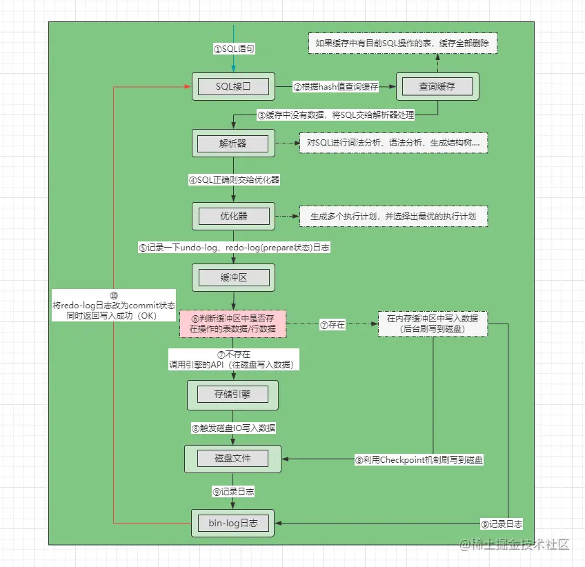

日志
===

执行一条Update语句，期间会发生什么：

- 客户端先通过连接器建立连接，连接器自会判断用户身份；
- 因为这是一条 update 语句，所以不需要经过查询缓存，但是表上有更新语句，是会把整个表的查询缓存清空的，所以说查询缓存很鸡肋，在 MySQL 8.0 就被移除这个功能了；
- 解析器会通过词法分析识别出关键字 update，表名等等，构建出语法树，接着还会做语法分析，判断输入的语句是否符合 MySQL 语法；
- 预处理器会判断表和字段是否存在；
- 优化器确定执行计划，因为 where 条件中的 id 是主键索引，所以决定要使用 id 这个索引；
- 执行器负责具体执行，找到这一行，然后更新。

此外，更新的语句的流程会涉及到 undo log（回滚日志）、redo log（重做日志） 、binlog （归档日志）这三种日志：

- **undo log（回滚日志）**：是 Innodb 存储引擎层生成的日志，实现了事务中的**原子性**，主要**用于事务回滚和 MVCC**。
- **redo log（重做日志）**：是 Innodb 存储引擎层生成的日志，实现了事务中的**持久性**，主要**用于掉电等故障恢复**；
- **binlog （归档日志）**：是 Server 层生成的日志，主要**用于数据备份和主从复制**；

## 为什么需要undo log

### 保障事务的原子性

MySQL默认开启自动提交事务，但是如果事务没有提交，MySQL发生了崩溃，需要回滚到事务之前的数据，从而保证事物的原子性。

在事务执行的过程中，MySQL会先记录更新前的数据到undo log日志文件当中，当事务回滚时，利用undo log进行回滚。

- 每当 InnoDB 引擎对一条记录进行操作（修改、删除、新增）时，要把回滚时需要的信息都记录到 undo log 里。
- 回滚时，就读取undo log里的数据，然后做原先**相反**操作。

> 当一个事务需要回滚时，本质上并不会以执行反`SQL`的模式还原数据，而是直接将`roll_ptr`回滚指针指向的`Undo`记录，从`xx.ibdata`共享表数据文件中拷贝到`xx.ibd`表数据文件，覆盖掉原本改动过的数据。

- 一条记录的每一次更新操作产生的 undo log 格式都有一个 roll_pointer 指针和一个 trx_id 事务id：
  - 通过 trx_id 可以知道该记录是被哪个事务修改的；
  - 通过roll_pointer 指针可以将这些 undo log 串成一个链表，这个链表就被称为版本链；
- `InnoDB`默认是将`Undo-log`存储在`xx.ibdata`共享表数据文件当中，默认采用段的形式存储。
  - 当一个事务尝试写某行表数据时，首先会将旧数据拷贝到`xx.ibdata`文件中，将表中行数据的隐藏字段：`roll_ptr`回滚指针会指向`xx.ibdata`文件中的旧数据，然后再写表上的数据。
  - 那`Undo-log`究竟在`xx.ibdata`文件中怎么存储呢？在共享表数据文件中，有一块区域名为`Rollback Segment`回滚段，每个回滚段中有`1024`个`Undo-log Segment`，每个`Undo`段可存储一条旧数据，而执行写`SQL`时，`Undo-log`就是写入到这些段中。

### 多版本并发控制

> 如何实现MVCC的

MVCC 是通过 ReadView + undo log 实现的。undo log 为每条记录保存多份历史数据，MySQL 在执行快照读（普通 select 语句）的时候，会根据事务的 Read View 里的信息，顺着 undo log 的版本链找到满足其可见性的记录。

## 为什么需要Buffer Pool

MySQL数据都是存储到磁盘当中，当需要更新一条记录时，从磁盘读取记录，然后在内存中修改这条记录，先缓存起来，便于后续查询直接命中，**减少磁盘IO**。因此有了Buffer Pool。

- 读取数据时，如果数据在Buffer Pool当中，客户端会直接读取Buffer Pool中的数据，否则再去磁盘中读取。
- 当修改数据时，如果数据存在Buffer Pool当中，直接修改Buffer Pool中数据，然后将其设置为**脏页**，等待后台线程选择合适的时机将脏页写入磁盘中。

- Buffer Pool以页为单位进行缓存数据，一个页的默认大小为16KB。

- Buffer Pool 除了缓存「索引页」和「数据页」，还包括了 Undo 页，插入缓存、自适应哈希索引、锁信息等等。

- 当我们查询一条记录时，InnoDB 是会把整个页的数据加载到 Buffer Pool 中，将页加载到 Buffer Pool 后，再通过页里的「页目录」去定位到某条具体的记录。

事务提交后不会立马删除`Undo`记录，因为可能会有其他事务在通过快照，读`Undo`版本链中的旧数据，直接移除可能会导致其他事务读不到数据，因此删除的工作就交给了`purger`线程。

## 为什么需要redo log

### 事务的持久性

Buffer Pool提高了读写效率，减少磁盘IO，但是基于内存的Buffer Pool遭遇断电重启，还没更新的脏页数据会丢失。为了防止断电导致数据丢失的问题，当一条记录更新的时候，InnoDB引擎就会先更新内存（同时标记为脏页），将本次对页的修改以redo log形式记录下来，后续先将redo log持久化。

后续，InnoDB 引擎会在适当的时候，由后台线程将缓存在 Buffer Pool 的脏页刷新到磁盘里，这就是 **WAL （Write-Ahead Logging）技术**。

> WAL 技术指的是， MySQL 的写操作并不是立刻写到磁盘上，而是先写日志，然后在合适的时间再写到磁盘上。

在事务提交时，只要先将 redo log 持久化到磁盘即可，可以不需要等到脏页数据持久化到磁盘。当系统崩溃时，虽然脏页数据没有持久化，但是 redo log 已经持久化，接着 MySQL 重启后，可以根据 redo log 的内容，将所有数据恢复到最新的状态。

redo log 记录了此次事务「**完成后**」的数据状态，记录的是更新**之后**的值；

undo log 记录了此次事务「**开始前**」的数据状态，记录的是更新**之前**的值；

### 为什么不直接将数据写入磁盘

写入 redo log 的方式使用了追加操作， 所以磁盘操作是**顺序写**，而写入数据需要先找到写入位置，然后才写到磁盘，所以磁盘操作是**随机写**。

磁盘的「顺序写 」比「随机写」 高效的多，因此 redo log 写入磁盘的开销更小。先写入日志当中，再找合适的时间更新到磁盘上，开销更小。

此外，日志比数据先落入磁盘，就算MYSQL崩溃也可以通过日志恢复数据。

刷盘的时机由`innodb_flush_log_at_trx_commit`参数来控制，默认是处于第二个级别，也就是每次提交事务时都会刷盘，这也就意味着一个事务执行成功后，相应的`Redo-log`日志绝对会被刷写到磁盘中，因此无需担心会出现丢失风险。

### redo log何时持久化

redo log也有自己的buffer，先写入redo log buffer当中，后续再持久化到磁盘当中。

主要有下面几个时机：

- MySQL 正常关闭时；
- 当 redo log buffer中记录的写入量大于 redo log buffer 内存空间的一半时，会触发落盘；
- InnoDB 的后台线程每隔 1 秒，将 redo log buffer 持久化到磁盘。
- 每次事务提交时，都将缓存在 redo log buffer 里的 redo log 直接持久化到磁盘（这个策略可由 innodb_flush_log_at_trx_commit 参数控制）。

### redo log文件写满怎么办

默认情况下， InnoDB 存储引擎有 1 个重做日志文件组( redo log Group），「重做日志文件组」由有 2 个 redo log 文件组成。

> `MySQL`通过来回写这两个文件的形式记录`Redo-log`日志，用两个日志文件组成一个“环形”。

redo log循环写的形式，相当于一个环形，来重复写。对于已经刷新到磁盘的脏页，擦除旧的记录，腾出空间记录新的更新操作。

## 为什么需要binlog

MySQL 在完成一条更新操作后，Server 层还会生成一条 binlog，等之后事务提交的时候，会将该事物执行过程中产生的所有 binlog 统一写 入 binlog 文件。

binlog 文件是记录了所有**数据库表结构变更和表数据修改**的日志，不会记录查询类的操作，比如 SELECT 和 SHOW 操作。binlog是**所有引擎**都能用的日志。

早期MySQL只有MyISAM，但是MyISAM不支持事务，光靠bin-log不能进行灾难恢复，binlog 日志只能用于归档。后来引入InnoDB，为了保证crash-safe能力，增加了redo log。

- redo-log、undo-log缓冲区位于Buffer Pool当中，而`bin_log_buffer`是位于每条线程中的。
- `MySQL`设计时要兼容所有引擎，直接将`bin-log`的缓冲区，设计在线程的工作内存中，这样就能够让所有引擎通用，并且不同线程/事务之间，由于写的都是自己工作内存中的`bin-log`缓冲，因此并发执行时也不会冲突

### redo log和binlog有什么区别

①生效范围不同，`Redo-log`是`InnoDB`专享的，`Bin-log`是所有引擎通用的。

②写入方式不同，`Redo-log`是用两个文件循环写，而`Bin-log`是不断创建新文件追加写。

③文件格式不同，`Redo-log`中记录的都是变更后的数据，而`Bin-log`会记录变更`SQL`语句。

④使用场景不同，`Redo-log`主要实现故障情况下的数据恢复，`Bin-log`则用于数据灾备、同步。

> 如果不小心整个数据库的数据被删除了，能使用 redo log 文件恢复数据吗？

### 主从复制如何实现的

binlog记录MySQL上的所有变化并以二进制形式保存在磁盘上，复制的过程是将binlog中的数据从主库传输到从库中。

MySQL 集群的主从复制过程梳理成 3 个阶段，过程一般是**异步**的：

- **写入 Binlog**：主库写 binlog 日志，提交事务，并更新本地存储数据。
- **同步 Binlog**：把 binlog 复制到所有从库上，每个从库把 binlog 写到暂存日志中。
- **回放 Binlog**：回放 binlog，并更新存储引擎中的数据。

> - 从库数量越多会造成IO线程数量增加，log dump线程来处理复制请求，对主库资源消耗比较高，同时还受限于主库的网络带宽。

### binlog什么时候刷盘

事务执行过程中，先把日志写到 binlog cache（Server 层的 cache），事务提交的时候，再把 binlog cache 写到 binlog 文件中。

> 一个事务的binlog不能被拆开，需要保证一次性写入。因为规定一个线程只能同时有一个事务在执行，如果一个事务的binlog被拆开，在备库执行时会被当作多个事务分段执行，破坏了原子性。

1. 先写入binlog cache

MySQL 给每个线程分配了一片内存用于缓冲 binlog ，该内存叫 binlog cache，参数 binlog_cache_size 用于控制单个线程内 binlog cache 所占内存的大小。如果超过了这个参数规定的大小，就要暂存到磁盘。

2. 事务提交时，执行器把cache中完整的事务写入到binlog文件中，清空cache。这时才放到**page cache**，没有写入磁盘
3. 通过`sync_binlog`参数控制binlog刷到磁盘上的频率，权衡性能和安全。

## 为什么需要两阶段提交

在持久化redo log和binlog两份日志时，可能会出现半成功的状态，导致主从环境的数据不一致。这是因为 redo log 影响主库的数据，binlog 影响从库的数据，所以 redo log 和 binlog 必须保持一致才能保证主从数据一致。

因此有了两阶段提交，保证分布式事务的一致性，多个逻辑操作要么全部成功，要么全部失败。

包括了两个阶段，每个阶段都由协调者（Coordinator）和参与者（Participant）共同完成：

- 准备（Prepare）阶段
- 提交（Commit）阶段

### 两阶段提交的过程

在 MySQL 的 InnoDB 存储引擎中，开启 binlog 的情况下，MySQL 会同时维护 binlog 日志与 InnoDB 的 redo log，为了保证这两个日志的一致性，MySQL 使用了**内部 XA 事务**（是的，也有外部 XA 事务，跟本文不太相关，我就不介绍了），内部 XA 事务由 binlog 作为协调者，存储引擎是参与者。

> 补充

### 异常重启

- 在时刻AB发生崩溃时，此时redo log处于prepare状态，在 MySQL 重启后会按顺序扫描 redo log 文件，碰到处于 prepare 状态的 redo log，就拿着 redo log 中的 XID 去 binlog 查看是否存在此 XID：
  - 如果 binlog 中没有当前内部 XA 事务的 XID，说明 redolog 完成刷盘，但是 binlog 还没有刷盘，则回滚事务。对应时刻 A 崩溃恢复的情况。
    如果 binlog 中有当前内部 XA 事务的 XID，说明 redolog 和 binlog 都已经完成了刷盘，则提交事务。对应时刻 B 崩溃恢复的情况。
- **两阶段提交是以 binlog 写成功为事务提交成功的标识**，因为 binlog 写成功了，就意味着能在 binlog 中查找到与 redo log 相同的 XID。

### 两阶段提交有什么问题

两阶段提交虽然保证了两个日志文件的数据一致性，但是性能很差，主要有两个方面的影响：

- **磁盘 I/O 次数高**：对于“双1”配置，每个事务提交都会进行两次 fsync（刷盘），一次是 redo log 刷盘，另一次是 binlog 刷盘。
- **锁竞争激烈**：两阶段提交虽然能够保证「单事务」两个日志的内容一致，但在「多事务」的情况下，却不能保证两者的提交顺序一致，因此，在两阶段提交的流程基础上，还需要加一个锁来保证提交的原子性，从而保证多事务的情况下，两个日志的提交顺序一致。

引入了**组提交**，当有多个事务提交的时候，会将多个 binlog 刷盘操作合并成一个，从而减少磁盘 I/O 的次数。

## Error-log错误日志

`MySQL`线上`MySQL`由于非外在因素（断电、硬件损坏...）导致崩溃时，辅助线上排错的日志。

主要用于记录MySQL报错信息的，涵盖了`MySQL-Server`的启动、停止运行的时间，以及报错的诊断信息，也包括了错误、警告和提示等多个级别的日志详情。

默认开启，无法手动关闭。

## Slow-log慢查询日志

当一条`SQL`执行的时间超过规定的阈值后，那么这些耗时的`SQL`就会被记录在慢查询日志中。

查看慢查询日志定位问题，定位到产生问题的`SQL`后，再用`explain`这类工具去生成`SQL`的执行计划，然后根据生成的执行计划来判断为什么耗时长，是由于没走索引，还是索引失效等情况导致的。

默认关闭，慢查询日志在内存中是**没有缓冲区**的，也就意味着每次记录慢查询`SQL`，都必须触发磁盘`IO`来完成，因此阈值设的太小，容易使得`MySQL`性能下降；如果设的太大，又会导致无法检测到问题`SQL`，因此该值一定要设置一个合理值。

## General-log查询日志

`general log`即查询日志，`MySQL`会向其中写入所有收到的查询命令，如`select、show`等，同时要注意：无论`SQL`的语法正确还是错误、也无论`SQL`执行成功还是失败，`MySQL`都会将其记录下来。

默认关闭。

## Relay-log中继日志

从主机复制过来的`bin-log`数据放在哪儿呢？也就是放在`relay-log`日志中，中继日志的作用就跟它的名字一样，仅仅只是作为主从同步数据的“中转站”。

## 如何优化MySQL的磁盘I/O

合理设置redo log和binlog持久化到磁盘中的时机。
