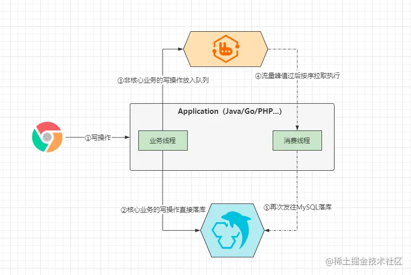
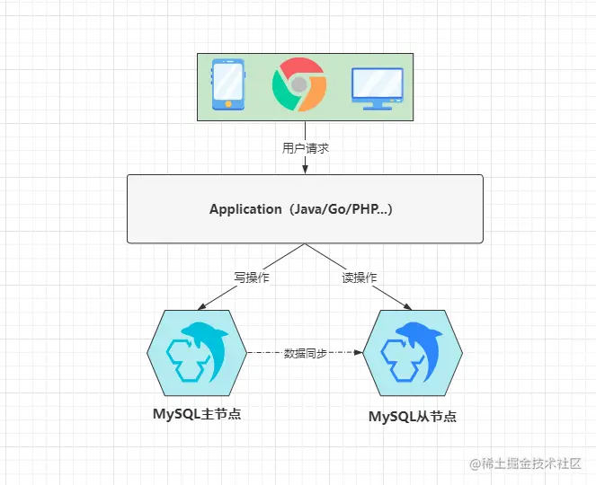
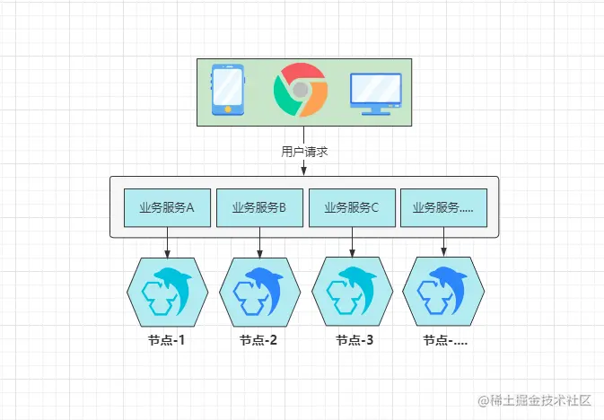

性能调优
===

## 面试问题

- 时间复杂度
- 

## 基准测试

可以观察系统在不同压力下的行为，评估系统的容量，掌握哪些是重要的变化，或者观察系统如何处理不同的数据。

### 分类

主要分为对整个系统测试以及单独测试MySQL。

- 整体测试关注整体的性能；证明MySQL不是应用的瓶颈；发现各个部分之间的缓存影响；更好揭示应用的真实表现。
- 单独测试，比较不同的schema或者查询的性能；针对具体问题测试；避免漫长的基准测试，短期简单测试

### 测试指标

- 吞吐量：单位时间内的事务处理数，每秒事务数TPS，每分钟事务数TPM。
- 响应时间或者延迟：测试任务所需的整体时间。
- 并发性：任意时间有多少同时发生的并发请求。
  - 一个好的应用，同时可以打开成百上千个Web数据库服务器连接，但可能同时只有少数连接在查询。
- 可扩展性：给系统增加一倍工作，在理想情况下能获得两倍的结果。大多数系统无法做到理想的线性扩展。

## Explain

### 如何使用

```sql
EXPLAIN SELECT 1;
```

使用`EXPLAIN`可以查看某个语句具体执行计划是什么。

### 输出各个列参数

- table
- id
  - 每出现一个select关键字，都会分配为一个唯一的id值。
  - 查询优化器可能对涉及子查询的查询语句进行重写，从而转换为连接查询（只有一个id值）
  - 出现多个ID值，这个值越大，表示执行的优先级越高
- select_type
  - 用来简单概述语句的作用。
  - 查询语句中不包含 UNION 或者子查询的查询都算作是 SIMPLE 类型。
  - 对于包含 UNION 、 UNION ALL 或者子查询的大查询来说，它是由几个小查询组成的，其中最左边的那个查询的 select_type 值就是 PRIMARY。
    - 其余的小查询的 select_type 值就是 UNION
  - 如果包含子查询的查询语句不能够转为对应的 semi-join 的形式，并且该子查询是不相关子查询，并且查询优化器决定采用将该子查询物化的方案来执行该子查询时，该子查询的第一个 SELECT 关键字代表的那个查询的 select_type 就是 SUBQUERY
  - 如果包含子查询的查询语句不能够转为对应的 semi-join 的形式，并且该子查询是相关子查询，则该子查询的第一个 SELECT 关键字代表的那个查询的 select_type 就是 DEPENDENT SUBQUERY 
  - 在包含 UNION 或者 UNION ALL 的大查询中，如果各个小查询都依赖于外层查询的话，那除了最左边的那个小查询之外，其余的小查询的 select_type 的值就是 DEPENDENT UNION
  - 对于采用物化的方式执行的包含派生表的查询，该派生表对应的子查询的 select_type 就是 DERIVED
  - 当查询优化器在执行包含子查询的语句时，选择将子查询物化之后与外层查询进行连接查询时，该子查询对应的 select_type 属性就是 MATERIALIZED 

- type
  - 对某个表执行查询时的访问方法
  - 全表扫描：All
  - 当表中只有一条记录并且该表使用的存储引擎的统计数据是精确的，比如MyISAM、Memory，那么对该表的访问方法就是 system 。
  - 当我们根据主键或者唯一二级索引列与常数进行等值匹配时，对单表的访问方法就是 const 
  - 在连接查询时，如果被驱动表是通过主键或者唯一二级索引列等值匹配的方式进行访问的（如果该主键或者唯一二级索引是联合索引的话，所有的索引列都必须进行等值比较），则对该被驱动表的访问方法就是eq_ref
  - 当通过普通的二级索引列与常量进行等值匹配时来查询某个表，那么对该表的访问方法就可能是 ref
  - 当对普通二级索引进行等值匹配查询，该索引列的值也可以是 NULL 值时，那么对该表的访问方法就可能是ref_or_null
  - 三种索引合并的方式来执行查询index_merge
  - 如果使用索引获取某些 范围区间 的记录，那么就可能使用到 range 访问方法
  - 当我们可以使用索引覆盖，但需要扫描全部的索引记录时，该表的访问方法就是 index 

- possible_keys和key
  - possible_keys列中的值并不是越多越好，可能使用的索引越多，查询优化器计算查询成本时就得花费更长时间，所以如果可以的话，尽量删除那些用不到的索引。

- key_len
  - 当优化器决定使用某个索引执行查询时，该索引记录的最大长度

- ref
  - 当使用索引列等值匹配的条件去执行查询时，与索引列作等值匹配的是什么
  - const匹配对象是一个常数

- rows
  - 预计需要扫描的行数

- filtered
  - 如果使用的是单表扫描，计算满足使用对应索引的搜索条件外的其他搜索条件的记录有多少条
  - 该值越小则表示执行时会扫描的数据量越大，取值范围是`0.00~100.00`。
  
- extra
  - Using index condition 索引条件下推

> 子查询物化：将子查询的结果存储在临时表中，然后在主查询中使用该临时表的结果来执行查询。避免重复计算。
>
> 常见的性能排序：`system → const → eq_ref → ref → fulltext → range → index → all`

## 索引优化

1. 独立的列：索引列不能是表达式的一部分，也不能是索引的参数。比如不要有计算表达式，MySQL无法自动解析。
2. 前缀索引和索引选择性：使用前缀索引可以避免长字符串索引带来的性能问题，但是会降低索引选择性。因此在实际中选择合适的前缀长度，来保障一定的选择性。
3. 多列索引：在5.0往后，可以使用多个单列索引，将结果合并。实际上当出现较多的索引合并的结果，应该建立正确的多列索引，而不是使用合并，合并过程涉及了缓存、排序和合并操作，浪费CPU和内存资源。
4. 选择合适的索引列顺序：将选择性较高的列排在前列。
5. 聚簇索引：数据页放在叶子节点。
6. 覆盖索引：使用索引直接获取列的值，而不是先查主键再回表查询。
7. 使用索引扫描来做排序：
8. 压缩（前缀压缩）索引：
9. 冗余和重复索引：(A，ID）也是一种重复，因为主键ID已经包含在二级索引当中了。所以应该尽量扩展已有的索引而不是创建新索引。
10. 未使用的索引：根据运行一段时间后，检查索引的使用频率来删除永远用不到的索引。
11. 索引和锁：索引能够让查询锁定更少的行，减少锁的开销，

## MySQL连接池

连接池是实现连接复用的手段，和mysql交互时，每次需要建立一个连接，用完就会关掉，这就是短连接。如果在高并发场景，反复建立连接的成本是很高的，所以我们可以使用长连接，即连接用完后先不关闭，放到一个池子里等待复用，这个池子就叫连接池。

通过以下参数来控制连接池中数量：

- **最大连接数**：可以稍大一些，能够打开连接的最大数量，超过阈值，会报错too many connections。
- **最大空闲连接数**：表示连接池中最多有多少个空闲连接 ，某个连接做完事务之后暂时空闲，如果连接池中空闲连接数没有达到上限，即可放入连接池。否则就释放避免浪费。
- **最大空闲时间**：连接池中连接使用完毕后会等到新的请求到来，表明了连接池中的连接在空闲时能在池子里摸鱼多久，如果长时间没有请求到来，说明请求量非常小，此时就需要释放掉连接来节省资源。
- 最小连接数：连接池中最小空闲连接数，当连接数少于此值时，连接池会创建新的连接来进行补充，作用主要是保持连接池始终处于就绪状态。
- 初始化连接数：初始化连接数目，实际意义不大，由最小连接数补齐即可。

---

初始连接池为空，创建一定数量的连接，完成后根据上述参数，放入连接池中，进行复用，超过最大空闲连接数就释放一部分避免浪费，不够用再建立新的连接，但是也不能太多。

---

### 为什么数据库连接数不是越大越好

- 数据库连接数越大，也就意味着内部创建出的工作线程会越多，线程越多代表需要的`CPU`配置得更高。超过CPU核心数后，不同核心在不同的线程间反复切换执行，上下文切换成本较高。
- 通过限制客户端连接池数量，达到限制服务到连接池的效果。
- `PostgreSQL`提供的计算公式：最大连接数 = (CPU核心数 \* 2) + 有效磁盘数
  - 这里如果使用的是SSD，那么有效磁盘数+1
- 对于偶发高峰类业务的连接数配置，可以设置最大连接数，连接存活时间调整，来确保资源的合理分配。
- **对于最佳连接数的计算，首先要把`CPU`核数放首位考虑，紧接着是磁盘，最后是网络带宽，因为带宽会影响`SQL`执行时间，综合考虑后才能计算出最合适的连接数大小。**

## MySQL结构优化

### 表结构优化

1. 表结构设计时，字段数量不能太多，`InnoDB`引擎基本上都会将数据操作放到**内存中完成**，而当一张表的字段数量越多，那么能载入内存的数据页会越少，当操作时数据不在内存，又不得不去磁盘中读取数据，这显然会很大程度上影响`MySQL`性能。
   - 应当尽可能将表结构拆分，精细化，确保内存中缓存的数据足够多，也便于维护。
   - 一张表最多最多只能允许设计`30`个字段左右，否则会导致查询时的性能明显下降。
2. 主键选择顺序递增的数值类型，最好为int类型
3. 对于实时性要求不高的数据建立中间表（单独针对某个指标的表），通过联表查询，然后每日定期更新中间表的数据，从而达到减小**重复连表查询**的开销，同时也能进一步提升查询速度。
4. 根据业务特性为每张不同的表选择合适的存储引擎

### 字段结构的优化

要指选择合适的数据类型，大多数开发在设计表字段结构时，如果要使用数值类型一般会选择`int`，使用字符串类型一般会选择`varchar`，但这些字段类型可以适当的做些调整。

在选择字段的数据类型时有三个原则：

- ①在保证足够使用的范围内，选择最小数据类型，因为它们会占用更少的磁盘、内存和`CPU`缓存，同时在处理速度也会更快。
- ②尽量避免索引字段值为`NULL`，定义字段时应尽可能使用`NOT NULL`关键字，因为字段空值过多会影响索引性能。
- ③在条件允许的情况下，尽量使用最简单的类型代替复杂的类型，如`IP`的存储可以使用`int`而并非`varchar`，因为简单的数据类型，操作时通常需要的`CPU`资源更少。

### 索引结构的优化

1. 索引字段的组成尽量选择多个，如果一个表中需要建立多个索引，应适当根据业务去将多个单列索引组合成一个联合索引，这样做一方面可以节省磁盘空间，第二方面还可以充分使用索引覆盖的方式查询数据，能够在一定程度上提升数据库的整体性能。
2. 避免索引过长，可以选择合适长度建立索引，而不是使用完整的字段值。
3. 索引类型的选择一定要合理，对于经常做模糊查询的字段，可以建立全文索引来代替普通索引，因为基于普通索引做`like`查询会导致索引失效，而采用全文索引的方式做模糊查询效率会更高更快，并且全文索引的功能更为强大。
4. 索引结构的选择可以根据业务进行调整，在某些不会做范围查询的字段上建立索引时，可以选用`hash`结构代替`B+Tree`结构，因为`Hash`结构的索引是所有数据结构中最快的，散列度足够的情况下，复杂度仅为`O(1)`。

## MySQL参数优化

### InnoDB缓冲区

`InnoDB`将是`MySQL`启动后使用最多的引擎，所以为其分配一个足够大的缓冲区，能够在最大程度上提升`MySQL`的性能。

当`InnoDB`缓冲区空间大于`1GB`时，`InnoDB`会自动将缓冲区划分为多个实例空间，这样做的好处在于：**多线程并发执行时，可以减少并发冲突**。

### 调整工作线程的缓冲区

调大`sort_buffer、read_buffer、join_buffer`几个区域，这几个部分属于每个线程私有区域。

### 调整临时表空间

避免创建的临时表被写入到磁盘中，违背了创建临时表加速查询的初衷。

### 调整空闲线程的存活时间

手动调整成`30min~1h`左右，可以让无用的连接能及时释放，减少资源的占用。其他的通过客户端连接进行调整。

## 架构优化

### 引入缓存中间件——读压力

正常的项目业务中，往往读请求的数量远超写请求，如果将所有的读请求都落入数据库处理，这自然会对`MySQL`造成巨大的访问压力，严重的情况下甚至会由于流量过大，直接将数据库打到宕机。

因此有了Redis，架设在应用程序和数据库中间。

在缓存`Key`设计合理的情况下，至少能够为`MySQL`分担`70%`以上的读压力。查询`MySQL`之前先查询一次`Redis`，`Redis`中有缓存数据则直接返回，没有数据时再将请求交给`MySQL`处理，从`MySQL`查询到数据后，再次将数据写入`Redis`，后续有相同请求再来读取数据时，直接从`Redis`返回数据即可。

### 引入消息中间件——写压力



### MySQL主从读写分离

- 主从复制：一台为主机，另一台为从机，从节点会一直不断的从主节点上同步增量数据，当主节点发生故障时，从节点可以替换原本的主节点，以此来为客户端提供正常服务。

  - 在主从复制上，实现读写分离，由于主机写和从机上同步有延迟，可能造成在从机上读的数据不一致情况。
  - 一般适合读大于写的情况。

  

- 双主双写热备：两台主机可以同时读写操作，请求可以在任意一台主机上完成。两台主机之间要进行同步数据。

  - 为了兼容两者之间的数据，对于每张表的主键要处理好，保证主键的一致性。

- 分库分表：解决了多主主机造成的存储容量的木桶问题，每个业务读写不同的数据库，不会同步。

  


## SQL优化

### 编写SQL注意点

- 查询时尽量不要使用*
  - 分析成本高：使用`*`时，解析器需要先去解析出当前要查询的表上`*`表示哪些字段，因此会额外增加**解析成本**。
  - 网络开销大：当使用`*`时，查询时每条数据会返回所有字段值，然后这些查询出的数据会先被放到结果集中，最终查询完成后会统一返回给客户端，分机器部署，网络数据包体积增加。
  - 内存占用变高：查询全部数据，结果集更大，占用的内存更大，缓存的数据减少，还会降低命中，触发更多的磁盘IO，降低整体性能。
  - 难以维护，史记中的表字段和对象的映射关系，表结构改变业务也要做出改变。

- 连表查询时尽量不要关联太多表
  - 一旦关联太多的表，就会导致执行效率变慢，执行时间变长
  - 数据量会随表数量呈直线性增长，数据量越大检索效率越低。
  - 当关联的表数量过多时，无法控制好索引的匹配，涉及的表越多，索引不可控风险越大。

- 多表查询时一定要以小驱大
  - 先查小表，用小表的结果去大表中查询数据。
  - 结果集小的先执行。
- 索引失效的情况：
  - 不要使用like左模糊和全模糊查询
  - 查询时尽量不要对字段做空值判断：做空值判断的情况时，会导致索引失效，因为判断`null`的情况不会走索引
  - 不要在条件查询=前对字段做任何运算
  - !=、!<>、not in、not like、or...要慎用
- 必要情况下可以强制指定索引，在存在多个索引时，优化器不一定智能。
- 尽量将大事务拆分为小事务执行
  - 当一个事务比较大时，会导致一部分数据的锁定周期较长，在高并发情况下会引起大量事务出现阻塞，从而最终拖垮整个`MySQL`系统。
  - 大事务也会导致日志写入时出现阻塞，这种情况下会强制触发刷盘机制，大事务的日志需要阻塞到有足够的空间时，才能继续写入日志到缓冲区，这也可能会引起线上出现阻塞。
- 从业务设计层面减少大量数据返回的情况
  - 面对这种需求，应该分批返回给客户端，避免一次性数据量过大造成的网络阻塞，内存占用过高等问题。
  - 面对分页场景的：增量查询。
- 尽量避免深分页的情况出现
  - select xx,xx,xx from yyy limit 100000,10; 
  - select xx,xx,xx from yyy where 有序字段 >= nnn limit 10; 
  - 面对分页无序的情况，只能在业务上限制深度分页情况出现，比如搜索为例，只能看到前30页，如果还未找到他需要的内容，基本上就会换个更精准的关键词重新搜索。
- SQL务必要写完整，不要使用缩写法
  - 在`MySQL`底层都需要做一次转换，将其转换为完整的写法。
- 基于联合索引查询时请务必确保字段的顺序性
- 客户端的一些操作可以批量化完成
  - 多个操作回合成一句，节省网络资源的开销
- 明确仅返回一条数据的语句可以使用limit 1
  - 当程序匹配到一条数据时就会停止扫描，如果不加的情况下会将所有数据都扫描一次。

### SQL优化的行业标准

- 客户端访问时，能够在`1s`内得到响应，用户会觉得系统响应很快，体验非常好。
- **客户端访问时，`1~3`秒内得到响应，处于可以接受的阶段，其体验感还算不错。**
- **客户端访问时，需要等待`3~5`秒时才可响应，这是用户就感觉比较慢了，体验有点糟糕。**
- 客户端访问时，一旦响应超过`5`秒，用户体验感特别糟糕，通常会选择离开或刷新重试。


