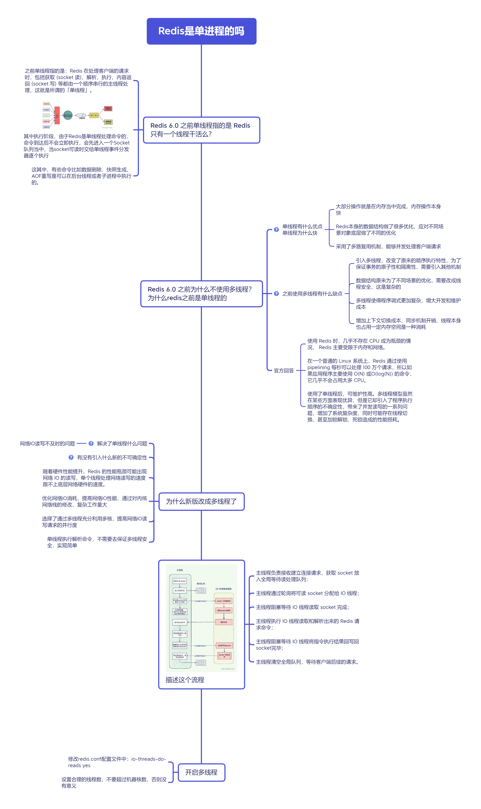

Redis是怎么运行的
===

## Redis在内存中是怎么存储的

Redis是内存存储的，以键值对形式，存在内存当中。

### 数据库结构

```cpp
/* Redis database representation. There are multiple databases identified
 * by integers from 0 (the default database) up to the max configured
 * database. The database number is the 'id' field in the structure. */
typedef struct redisDb {
    // 数据库键空间，保存着数据库中的所有键值对
    dict *dict;                 /* The keyspace for this DB */
    // 键的过期时间，字典的键为键，字典的值为过期事件 UNIX 时间戳
    dict *expires;              /* Timeout of keys with a timeout set */
    // 正处于阻塞状态的键
    dict *blocking_keys;        /* Keys with clients waiting for data (BLPOP) */
    // 可以解除阻塞的键
    dict *ready_keys;           /* Blocked keys that received a PUSH */
    // 正在被 WATCH 命令监视的键
    dict *watched_keys;         /* WATCHED keys for MULTI/EXEC CAS */
    struct evictionPoolEntry *eviction_pool;    /* Eviction pool of keys */
    // 数据库号码
    int id;                     /* Database ID */
    // 数据库的键的平均 TTL ，统计信息
    long long avg_ttl;          /* Average TTL, just for stats */
} redisDb;
```

- set a b，这个数据的存储结构时怎么样的

> Redis的存储是字典结构，set a b之后，a会放在字典的对应偏移位置，b作为对应的value进行存储。

- Set a后，调用TTL a 100，过期信息存放在哪里

> 存放在expire当中，一旦设置就加入。

### 常用指令

```sql
set hellomsg "hello world"

get hellomsg

del hellomsg
```

### 过期键

Redis数据可以设置过期键，到时间后自动过期回收，过期键存放在expires字典上。

一旦设置了过期键，立马加入expires当中，查询数据时先去expire字典上判断是否过期，过期就不返回。

在dict和expires中Key对象都是存储String对象指针，不会重复占用内容。

## 单线程 / 多线程模型



## Redis处理流程

1. 注册事件监听及回调函数；
2. 循环等待获取事件并处理；
3. 调用回调函数，处理数据逻辑；
4. 回写数据给 Client；

https://www.luozhiyun.com/archives/674

## 内存满了怎么办

Redis是基于内存存储的，在64位机器默认不会限制内存的使用，在 32 位操作系统中，maxmemory 的默认值是 3G。

实际中通过`maxmemory`来设置，超过这个配置值，会触发Redis内存淘汰。

当内存不足时，会腾出部分内存给新数据，因此Redis支持多种淘汰策略：

- 不进行数据淘汰的策略，**默认**是noeviction，如果内存达到了maxmemory，写入操作会失败，但是不会淘汰已有的数据。

- 针对「进行数据淘汰」这一类策略，又可以细分为「在设置了过期时间的数据中进行淘汰」和「在所有数据范围内进行淘汰」这两类策略。

  在设置了过期时间的数据中进行淘汰：

  - **volatile-random**：随机淘汰设置了过期时间的任意键值；
  - **volatile-ttl**：优先淘汰更早过期的键值。
  - **volatile-lru**（Redis3.0 之前，默认的内存淘汰策略）：淘汰所有设置了过期时间的键值中，最久未使用的键值；
  - **volatile-lfu**（Redis 4.0 后新增的内存淘汰策略）：淘汰所有设置了过期时间的键值中，最少使用的键值；
  
  在所有数据范围内进行淘汰：
  
  - **allkeys-random**：随机淘汰任意键值;
  - **allkeys-lru**：淘汰整个键值中最久未使用的键值；
  - **allkeys-lfu**（Redis 4.0 后新增的内存淘汰策略）：淘汰整个键值中最少使用的键值。


实际当中根据业务选择淘汰算法：

- 当数据比较重要，不能丢失，那么就选择不淘汰。但是这种情况会导致写入失败，需要完善的告警机制配合人工介入。
- 如果是缓存场景，业务一般使用LRU/LFU灵活的粗略。

淘汰时机：

每次运行读写命令时，都会调用processCommand函数，其又会调用freeMemoryIfNeed，这时候会尝试去释放一定的内存，根据上述的策略。
