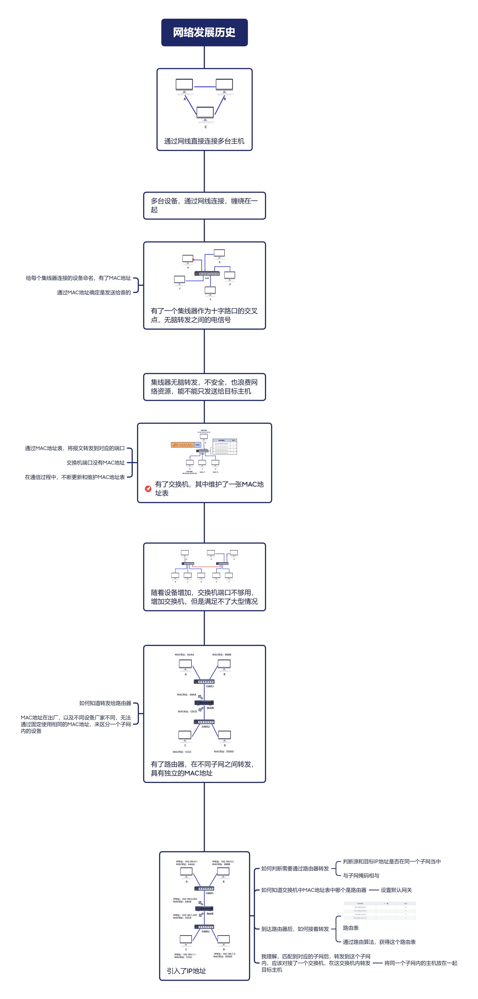
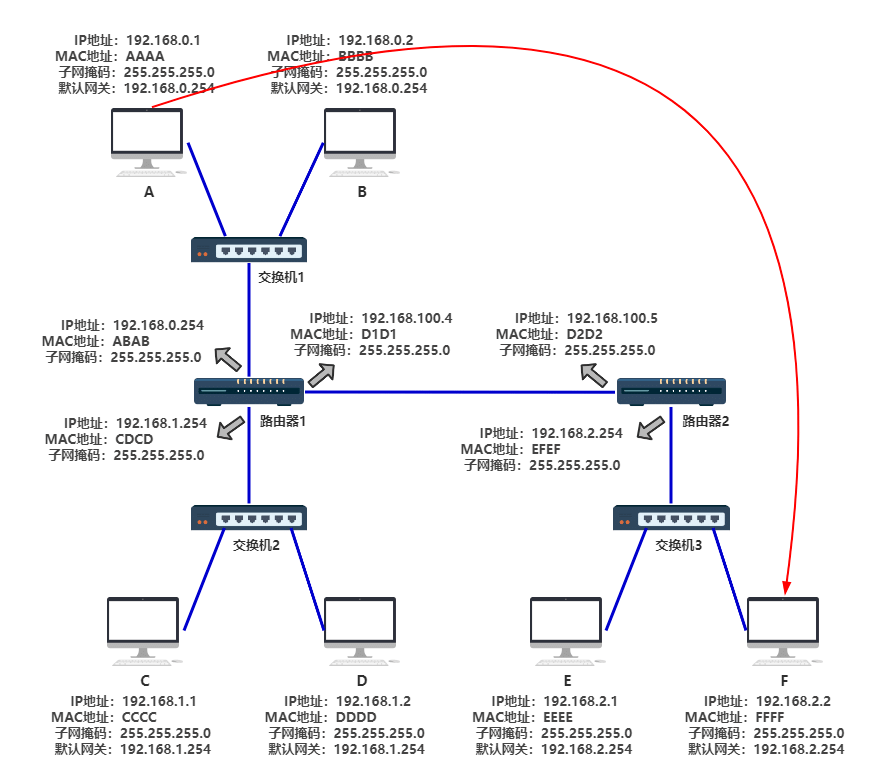

网络发展简单描述
===

## 演变过程

## 一个过程

- 先判断A和F在不在一个子网内
  - 通过二者的子网掩码与IP地址相与判断
  - 如果在一个子网内，查询**ARP缓存表**（通过ARP逐渐构建而成），直接端口转发
  - 如果不在一个子网内，转发到默认网关（路由器）
- 交换机中维护一张**MAC地址表**
  - 查询目标网络地址在路由表中，直接进行转发
  - 不在，会进行广播，转发到除了源主机以外的端口，如果找到更新MAC地址表
  - 这里，交换机发现目的MAC地址在表中，转发到路由器端口
- 路由器1收到后，去除MAC地址后，从**路由表**中匹配对应的IP地址，发现在路由器2当中，又进行封装发送给路由器2
- 路由器2收到后，通过ARP缓存，找到对应F的MAC地址，从1号端口转发
- 交换机3收到后，发现目的MAC地址是FFFF，查询MAC地址表，将其转发到F
- F最终收到