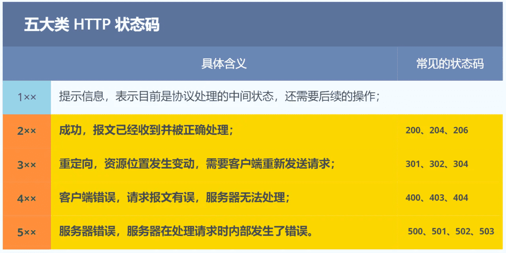
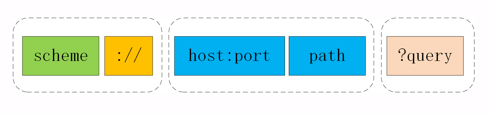
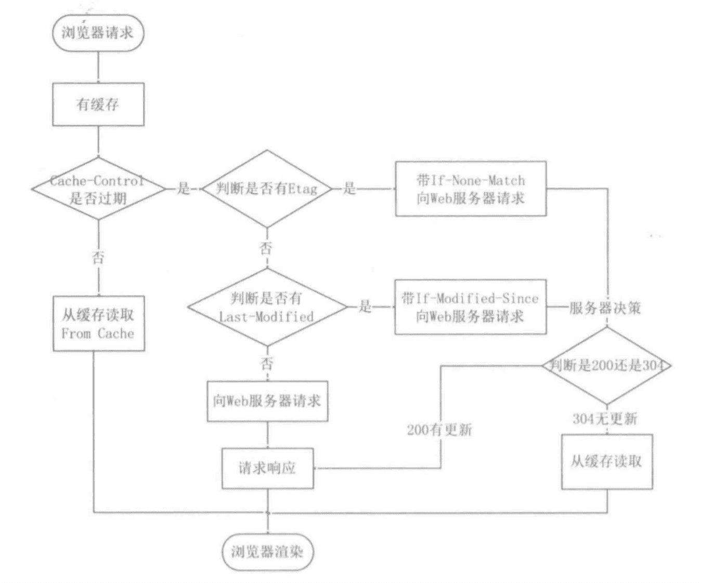

HTTP常见的问题
===

## 是什么

HTTP 是超文本传输协议，也就是HyperText Transfer Protocol。

可以拆分成三部分：

- 超文本：现如今的「超文本」，包括了图片、文字、视频等，最关键还有超链接。
- 传输：HTTP 是一个在计算机世界里专门用来在两点之间传输数据的约定和规范，两点之间有任意的中继。
- 协议：HTTP 是一个用在计算机世界里的协议。它使用计算机能够理解的语言确立了一种计算机之间交流通信的规范（两个以上的参与者），以及相关的各种控制和错误处理方式（行为约定和规范）。

**HTTP 是一个在计算机世界里专门在「两点」之间「传输」文字、图片、音频、视频等「超文本」数据的「约定和规范」。**

### 常见的状态码



- 200 OK，204 No Content，206 Partial Content，206 Content-Range
- 301 Moved Permanently，302 Found，304 Not Modified‘
- 400 Bad Request，403 Forbidden，404 Not Found
- 500 Internal Server Error，501 Not Implemented，502 Bad Gateway，503 Service Unavailable

### 常见字段

- connection中的`keep-live`和TCP中的`keepalive`的区别

## HTTP报文是什么样


HTTP 协议的请求报文和响应报文的结构基本相同，由三大部分组成：

1. 起始行（start line）：描述请求或响应的基本信息；
2. 头部字段集合（header）：使用 key-value 形式更详细地说明报文；
3. 消息正文（entity）：实际传输的数据，它不一定是纯文本，可以是图片、视频等二进制数据。

> - 这其中前两部分起始行和头部字段经常又合称为“**请求头**”或“**响应头**”，消息正文又称为“**实体**”，但与“**header**”对应，很多时候就直接称为“**body**”。
> - HTTP规定报文必须有header，可以没有body，在header之后必须有一个空行（CRLF）。

> 空行作为头部字段的结束标志，如果多了一个CRLF，服务器解析HTTP报文时会误以为读取完了所有头字段，开始解析报文主题。
>
> - 如果实际上没有实体或者为空，空行不会有太大影响
> - 如果不为空，额外空行会破坏HTTP报文的结构，可能会导致服务器无法正确解析报文

### 请求行

主要包括：

1. 请求方法：是一个动词，如 GET/POST，表示对资源的操作；
2. 请求目标：通常是一个 URI，标记了请求方法要操作的资源；
3. 版本号：表示报文使用的 HTTP 协议版本。

这三个部分通常使用空格（space）来分隔，最后要用 CRLF 换行表示结束。

### 状态行

响应报文的起始行，叫做状态行，而不叫做响应行。

主要包括：

1. 版本号：表示报文使用的 HTTP 协议版本；
2. 状态码：一个三位数，用代码的形式表示处理的结果，比如 200 是成功，500 是服务器错误；
3. 原因：作为数字状态码补充，是更详细的解释文字，帮助人理解原因。

### 头部字段

请求头和响应头的结构是基本一样的，唯一的区别是起始行。

头部字段是 key-value 的形式，key 和 value 之间用“:”分隔，最后用 CRLF 换行表示字段结束。比如在“Host: 127.0.0.1”这一行里 key 就是“Host”，value 就是“127.0.0.1”。

> HTTP头字段灵活，不仅可以使用标准的头，还可以自定义头。

本上可以分为四大类：

1. 通用字段：在请求头和响应头里都可以出现；
2. 请求字段：仅能出现在请求头里，进一步说明请求信息或者额外的附加条件；
3. 响应字段：仅能出现在响应头里，补充说明响应报文的信息；
4. 实体字段：它实际上属于通用字段，但专门描述 body 的额外信息。

常用字段：

- Host：请求字段，告诉服务器这个请求应该由哪个主机来处理。HTTP/1.1 里唯一要求**必须提供**的头字段是 Host，它必须出现在请求头里，标记虚拟主机名。
- User-Agent：请求字段，使用一个字符串来描述发起 HTTP 请求的客户端，服务器可以依据它来返回最合适此浏览器显示的页面，“Mozilla”“Chrome”“Safari”。
- Date：HTTP报文的创建时间，搭配其他字段决定缓存策略。
- Server：响应字段，只能出现在响应头里，告诉客户端当前正在提供 Web 服务的软件名称和版本号，例如在我们的实验环境里它就是“Server: openresty/1.15.8.1”，即使用的是 OpenResty 1.15.8.1。不是必须的，因为暴露了服务器信息，是危险的。
- Content-Length：实体字段，请求头或响应头空行后面数据的长度。服务器看到这个字段，就知道了后续有多少数据，可以直接接收。如果没有这个字段，那么 body 就是不定长的，需要使用 chunked 方式分段传输。

## 请求方法

1. GET：获取资源，可以理解为读取或者下载数据；
2. HEAD：获取资源的元信息；
3. POST：向资源提交数据，相当于写入或上传数据；
4. PUT：类似 POST；
5. DELETE：删除资源；
6. CONNECT：建立特殊的连接隧道；
7. OPTIONS：列出可对资源实行的方法；
8. TRACE：追踪请求 - 响应的传输路径。

### GET

- 一般GET 的语义是从服务器获取指定的资源，包括文本、视频、页面等多个资源，也可以是由 PHP、Java 动态生成的页面或者其他格式的数据。
- GET一般写在url中，浏览器会对url的长度有限制

### HEAD

- 与GET方法类似，也是请求从服务器获取资源，服务器返回响应头，资源的元信息，不返回实体数据。
- 响应头与 GET 完全相同，所以可以用在很多并不真正需要资源的场合，避免传输 body 数据的浪费。比如检查一个文件是否存在，检查一个文件是否有最新版本

### POST

- POST 的语义是根据请求负荷（报文body）对指定的资源做出处理。
- POST 请求携带数据的位置一般是写在报文 body 中，body中的数据可以是任意格式的数据，只要客户端与服务端协商好即可，而且浏览器不会对 body 大小做限制。

### PUT

- 通常 POST 表示的是“新建”“create”的含义，而 PUT 则是“修改”“update”的含义。
- 因为它与 POST 的语义、功能太过近似，有的服务器甚至就直接禁止使用 PUT 方法，只用 POST 方法上传数据。

### 安全与幂等

概念：

- 安全：指请求方法不会“破坏”服务器上的资源，即不会对服务器上的资源造成实质的修改。
- 幂等：多次执行相同的操作，结果都是相同的。

安全很容易分辨：GET和HEAD是只读的，POST和PUT会修改。

幂等：GET和HEAD只读很容易区分，而POST是多次提交数据会创建多个资源不是幂等的，相当于INSERT，而PUT相当于UPDATE所以是幂等的。DELET重复删除同一个资源会提示不存在，所以也是幂等的。

### GET VS POST

- 一般情况下，安全和幂等关系，是否可以缓存
  - 因此一般情况下，GET方法只读所以是安全和幂等的，POST方法会提交和修改数据是不安全和不幂等的。
  - 实际中GET方法用于新增和修改数据就可能是不安全不幂等的，同理POST请求也是。
- GET请求可以带上body吗
  - 任何请求都可以用上body，只是GET请求获取资源用不上body
  - 同理，URL查询不是GET独有的，POST请求中URL也有参数

## 写出正确的网址

URI是统一资源标识符，本质上是一个字符串，唯一地标记资源的位置或者名字。

URI 最常用的形式，由 scheme、host:port、path 和 query 四个部分组成，但有的部分可以视情况省略。



- `scheme`表示协议名，表示资源使用哪个协议来访问。常见的http，https。
- `://`将`scheme`和后面部分分离。
- `host:port`表示资源所在的主机名和端口号
  - 主机名可以是 IP 地址或者域名的形式，必须要有，否则浏览器就会找不到服务器。
  - 但端口号有时可以省略，浏览器等客户端会依据 scheme 使用默认的端口号，例如 HTTP 的默认端口号是 80，HTTPS 的默认端口号是 443。
- `path`表示资源所在位置。比如`/11-1`、`/rfc2023`
- `?query`表示查询资源，是多个“key=value”的字符串，这些 KV 值用字符“&”连接，浏览器和客户端都可以按照这个格式把长串的查询参数解析成可理解的字典或关联数组形式。是对资源附加的额外要求。
- `#fragment`是 URI 所定位的资源内部的一个“锚点”或者说是“标签”，浏览器可以在获取资源后直接跳转到它指示的位置。仅能由浏览器这样的客户端使用。

---

- URI只能使用ASCII码，对于其他的字符转换为16进制字节值。

## HTTP 的实体数据

### 数据类型

1. text：即文本格式的可读数据，我们最熟悉的应该就是 text/html 了，表示超文本文档，此外还有纯文本 text/plain、样式表 text/css 等。
2. image：即图像文件，有 image/gif、image/jpeg、image/png 等。
3. audio/video：音频和视频数据，例如 audio/mpeg、video/mp4 等。
4. application：数据格式不固定，可能是文本也可能是二进制，必须由上层应用程序来解释。常见的有 application/json，application/javascript、application/pdf 等，另外，如果实在是不知道数据是什么类型，像刚才说的“黑盒”，就会是 application/octet-stream，即不透明的二进制数据。

---

Encoding type：数据是用的什么编码格式，这样对方才能正确解压缩，还原出原始的数据。

1. gzip：GNU zip 压缩格式，也是互联网上最流行的压缩格式；
2. deflate：zlib（deflate）压缩格式，流行程度仅次于 gzip；
3. br：一种专门为 HTTP 优化的新压缩算法（Brotli）。

---

实际中用Accept标记希望接收到的数据类型以及编码格式，Content字段用来告知客户端实际的报文中数据类型的压缩格式。

- 如果请求报文中Accept-Encoding 字段，就表示客户端不支持压缩数据；
- 如果响应报文里没有 Content-Encoding 字段，就表示响应数据没有被压缩。

### 语言类型与编码

- 为了让浏览器显示出每个人都可理解可阅读的语言文字，引入了语言类型和字符集
- 语言类型中，地区性方言，用type-subtype表示，比如en-US表示美式英语，en-GB表示英式英语
- 字符集当中有英语ASCII，汉语的GBK，后来出现了UTF-8成为了互联网上的标准字符集

### 内容协商结果

用Vary字段记录服务器在协商参考的请求字段，如：

```html
Vary: Accept-Encoding,User-Agent,Accept
```

## 数据压缩

通常浏览器在发送请求时都会带着“**Accept-Encoding**”头字段，里面是浏览器支持的压缩格式列表，例如 gzip、deflate、br 等，这样服务器就可以从中选择一种压缩算法，放进“**Content-Encoding**”响应头里，再把原数据压缩后发给浏览器。

一般情况对文字压缩效率比较高，而图片、音视频本身已经是高度压缩的，因此使用gzip也不会再变小，甚至可能增大。所以各大网站的服务器都会使用这个手段作为“保底”。例如，在 Nginx 里就会使用“gzip on”指令，启用对“text/html”的压缩。

### 分块传输

将文件分块传输，在 HTTP 协议里就是“**chunked**”分块传输编码，在响应报文里用头字段“**Transfer-Encoding: chunked**”来表示，意思是报文里的 body 部分不是一次性发过来的，而是分成了许多的块（chunk）逐个发送。

此外，分块传输也可以用于流式数据，例如由数据库动态生成的表单页面，这种情况下 body 数据的长度是未知的，无法在头字段“**Content-Length**”里给出确切的长度，所以也只能用 chunked 方式分块发送。

“Transfer-Encoding: chunked”和“Content-Length”这两个字段是**互斥的**，也就是说响应报文里这两个字段不能同时出现。

### 范围请求

允许客户端在请求头里使用专用字段来表示只获取文件的一部分，比如在线播放视频时跳转到某个部分。

范围请求不是 Web 服务器必备的功能，可以实现也可以不实现，所以服务器必须在响应头里使用字段“**Accept-Ranges: bytes**”明确告知客户端：“我是支持范围请求的”。

常用的下载工具里的多段下载、断点续传也是基于它实现的，要点是：

- 先发个 HEAD，看服务器是否支持范围请求，同时获取文件的大小；
- 开 N 个线程，每个线程使用 Range 字段划分出各自负责下载的片段，发请求传输数据；
- 下载意外中断也不怕，不必重头再来一遍，只要根据上次的下载记录，用 Range 请求剩下的那一部分就可以了。

### 多端数据

为了一次性获取多个片段的值，需要使用一种特殊的 MIME 类型：“**multipart/byteranges**”，表示报文的 body 是由多段字节序列组成的，并且还要用一个参数“**boundary=xxx**”给出段之间的分隔标记。

## 重定向和跳转

当我们点击一个链接，浏览器解析URI，用这个URI发起一个新的HTTP请求，获取响应报文后切换显示的内容，渲染出新URI指向的页面。这样的方式称为“主动跳转”。

重定向的过程，当收到301或者302报文时，检查响应头里有没有Location，如果有就从字段值提取出URI，发起新的HTTP请求，整个过程是无感的。

此外重定向如果针对是站内，可以放心使用相对URI，否则要使用绝对URI，包括前面的请求协议等。

应用场景：

- 一个最常见的原因就是“**资源不可用**”，需要用另一个新的 URI 来代替。
- “**避免重复**”，让多个网址都跳转到一个 URI，增加访问入口的同时还不会增加额外的工作量。

## 连接管理

### 短连接

最早短连接底层的数据传输基于 TCP/IP，每次发送请求前需要先与服务器建立连接，收到响应报文后会立即关闭连接。不会与服务器保持长时间的连接状态，所以被称为短连接。

在TCP协议里，连接和关闭连接都是昂贵的操作。TCP 建立连接要有“三次握手”，发送 3 个数据包，需要 1 个 RTT；关闭连接是“四次挥手”，4 个数据包需要 2 个 RTT。

短连接的缺点严重制约了服务器的服务能力，导致它无法处理更多的请求。

### 长连接

因为只在第一次时建立连接，在最后一次时关闭连接。

由于长连接对性能的改善效果非常显著，所以在 HTTP/1.1 中的连接都会默认启用长连接。

在请求头里明确地要求使用长连接机制，使用的字段是**Connection**，值是“**keep-alive**”。

在客户端，可以在请求头里加上“**Connection: close**”字段，告诉服务器：“这次通信后就关闭连接”来主动关闭长连接，避免资源浪费。

通常服务器不会主动关闭连接，一般设置一些策略比如超时时间，长连接上可发送的最大请求次数。

### 队头阻塞

HTTP 规定报文必须是“一发一收”，这就形成了一个先进先出的“串行”队列。

如果队首的请求因为处理的太慢耽误了时间，那么队列里后面的所有请求也不得不跟着一起等待，结果就是其他的请求承担了不应有的时间成本。

### 性能优化

因为“请求 - 应答”模型不能变，所以“队头阻塞”问题在 HTTP/1.1 里无法解决，只能缓解。

**并发连接**，同时对一个域名发起多个长连接，用数量来解决质量的问题。但是过多的连接会对服务器造成过大的压力。

“**域名分片**”（domain sharding）技术，还是用数量来解决质量的思路。多个域名指向同一台服务器，实际长连接的数量就上去了。

## Cookie机制

HTTP是无状态的，无法支持需要记录状态的操作。随后引入了Cookie机制。

- 第一次发送请求时，请求报文里带有Cookie字段，响应报文当中回应Set-Cookie字段，之后的报文中将这个值保存到Cookie当中，发送给服务器。
  - 服务器可能会设置多个set-cookie
  - 浏览器发送时，只要在一个cookie字段中包含这些cookie就行
  - Cookie以key-value形式
- 第二次请求，Cookie字段携带之前得到的数据进行发送。
- cookie存储在浏览器当中，而不是操作系统当中，当然也有硬盘类型的Cookie（持久化）。
- 一般来说，系统会把状态信息保存在服务端，在 Cookie 里只传输的是一个无字面意义的、不重复的字符串，习惯上以`sessionid`或者`jsessionid`为名，服务器拿这个字符串为 Key，在内存中开辟一块空间，以 Key/Entity 的结构存储每一个在线用户的上下文状态，再辅以一些超时自动清理之类的管理措施。

### 属性字段

```html
Set-Cookie: <cookie名>=<cookie值>

HTTP/1.0 200 OK
Content-type: text/html
Set-Cookie: yummy_cookie=choco
Set-Cookie: tasty_cookie=strawberry
```

- Expires：过期时间
- Max-Age：用的是相对时间
- Domain和Path：指定了 Cookie 所属的域名和路径，浏览器在发送 Cookie 前会从 URI 中提取出 host 和 path 部分，对比 Cookie 的属性。如果不满足条件，就不会在请求头里发送 Cookie。也可以根据不同的域名和路径设置各自的Cookie。
- HttpOnly：会告诉浏览器，此 Cookie 只能通过浏览器 HTTP 协议传输，禁止其他方式访问，浏览器的 JS 引擎就会禁用 document.cookie 等一切相关的 API，脚本攻击也就无从谈起了。
- SameSite：可以防范“跨站请求伪造”（XSRF）攻击，设置成“SameSite=Strict”可以严格限定 Cookie 不能随着跳转链接跨站发送，而“SameSite=Lax”则略宽松一点，允许 GET/HEAD 等安全方法，但禁止 POST 跨站发送。
- “Secure”，表示这个 Cookie 仅能用 HTTPS 协议加密传输，明文的 HTTP 协议会禁止发送。Cookie 本身不是加密的，浏览器里还是以明文的形式存在。

### 身份识别

第一次登陆时，通过用户的登录信息，返回一个Cookie，作为一个身份标签，后续的请求通过Cookie发送给服务器，避免了重复登录，实现了状态保持。

### 广告跟踪

例如 Google，它会上网时“偷偷地”给你贴上 Cookie 小纸条，这样你上其他的网站，别的广告就能用 Cookie 读出你的身份，然后做行为分析，再推给你广告。

这种 Cookie 不是由访问的主站存储的，所以又叫“第三方 Cookie”（third-party cookie）。

### 存在问题

Cookie 常用来标记用户或授权会话，被浏览器发出之后可能被劫持，被用于非法行为，可能导致授权用户的会话受到攻击，因此存在安全问题。

还有一种情况就是跨站请求伪造CSRF，简单来说 比如你在登录银行网站的同时，登录了一个钓鱼网站，在钓鱼网站进行某些操作时可能会获取银行网站相关的Cookie信息，向银行网站发起转账等非法行为。

明文，有数量和容量限制，每次都要发送额外的流量消耗，复杂的Cookie行为无法满足。

## Session机制

Cookie机制在最初和服务端完成交互后，保持状态所需的信息都将**存储在客户端**，后续直接读取发送给服务端进行交互。

Session代表服务器与浏览器的一次**会话过程**，并且完全有服务端掌控，实现分配唯一ID、会话信息存储、会话检索等功能。

Session机制将用户的所有活动信息、上下文信息、登录信息等都**存储在服务端**数据库，只是生成一个唯一标识ID发送给客户端，后续的交互将没有重复的用户信息传输，取而代之的是唯一标识ID，暂且称之为Session-ID吧。

### 交互流程

- 当客户端第一次请求session对象时候，服务器会为客户端创建一个session，并将通过特殊算法算出一个session的ID，用来标识该session对象。
- 当浏览器下次请求别的资源的时候，浏览器会将sessionID放置到请求头中，服务器接收到请求后解析得到sessionID，服务器找到该id的session来确定请求方的身份和一些上下文信息。
- Cookie过期后，浏览器一般会自动删除这个Cookie。

### 实现方式

主要包括两种方式cookie与url重写，而cookie是首选方式，因为各种现代浏览器都默认开通cookie功能，但是每种浏览器也都有允许cookie失效的设置，因此对于Session机制来说还需要一个备胎。

将会话标识号以参数形式附加在超链接的URL地址后面的技术称为URL重写，比如`http://taobao.com/getitem?sessionid=1wui87htentg&?name=baymax&action=buy`。

### 存在问题

- 由于Session信息是存储在服务端的，因此如果用户量很大的场景，Session信息占用的空间过大。
- 对于大型网站必然是集群化&分布式的服务器配置，如果Session信息是存储在本地的，那么由于负载均衡的作用，原来请求机器A并且存储了Session信息，下一次请求可能到了机器B，此时机器B上并没有Session信息。
  - 在B机器重复创建，造成浪费
  - 引入高可用的Session集群方案，引入Session代理实现信息共享，要么实现定制化哈希到集群A，这样做其实就有些复杂了。

## Token方案

Token是令牌的意思，由服务端生成并发放给客户端，具有时效性的一种验证身份的手段。

如果采用上面的Session-cookie形式，在大流量场景下，需要分流到其他服务器，其他服务器进行验证时，需要通用的Seesion ID。

如果用数据库存储ID，数据库崩溃，会导致整体失败。 

### 交互流程


- 客户端将用户的账号和密码提交给服务器
- 服务器对其进行校验，通过则生成一个token值，服务端只保存**JWT签名密文**，同时返回给客户端JWT，作为后续的请求交互身份令牌
- 客户端拿到服务端返回的token值后，可将其**保存在本地**，以后每次请求服务器时都携带该token，提交给服务器进行身份校验
- 服务器接收到请求后，解析出其中的Token，再根据相同的加密算法和参数生成Token与客户端的Token进行对比，一致则通过，否则拒绝服务
- Token验证通过，服务端就可以根据该Token中的uid获取对应的用户信息，进行业务请求的响应

### 方案优点

- Token可以跨站共享，实现单点登录
- Token机制无需太多存储空间，Token包含了用户的信息，只需在客户端存储状态信息即可，对于服务端的扩展性很好
- Token机制的安全性依赖于服务端加密算法和密钥的安全性

## JWT

### 跨域认证

举例来说，A 网站和 B 网站是同一家公司的关联服务。现在要求，用户只要在其中一个网站登录，再访问另一个网站就会自动登录，请问怎么实现？

> 一种解决方案是 session 数据持久化，写入数据库或别的持久层。各种服务收到请求后，都向持久层请求数据。这种方案的优点是架构清晰，缺点是工程量比较大。另外，持久层万一挂了，就会单点失败。
>
> 另一种方案是服务器索性不保存 session 数据了，所有数据都保存在客户端，每次请求都发回服务器。JWT 就是这种方案的一个代表。

### 原理

JWT 的原理是，服务器认证以后，生成一个 JSON 对象，发回给用户，就像下面这样。

```html
{
  "姓名": "张三",
  "角色": "管理员",
  "到期时间": "2018年7月1日0点0分"
}
```

以后，用户与服务端通信的时候，都要发回这个 JSON 对象。服务器完全只靠这个对象认定用户身份。为了防止用户篡改数据，服务器在生成这个对象的时候，会加上签名（详见后文）。

### 组成

JWT 包含三个部分，`Header.Payload.Signature`。

#### Header

Header 部分是一个 JSON 对象，描述 JWT 的元数据，通常是下面的样子。

> ```javascript
> {
>   "alg": "HS256",
>   "typ": "JWT"
> }
> ```

上面代码中，`alg`属性表示签名的算法（algorithm），默认是 HMAC SHA256（写成 HS256）；`typ`属性表示这个令牌（token）的类型（type），JWT 令牌统一写为`JWT`。

最后，将上面的 JSON 对象使用 Base64URL 算法（详见后文）转成字符串。

#### Payload

Payload 部分也是一个 JSON 对象，用来存放实际需要传递的数据。JWT 规定了7个官方字段，供选用。

> - iss (issuer)：签发人
> - exp (expiration time)：过期时间
> - sub (subject)：主题
> - aud (audience)：受众
> - nbf (Not Before)：生效时间
> - iat (Issued At)：签发时间
> - jti (JWT ID)：编号
>
> - 自定义私有字段

这个 JSON 对象也要使用 Base64URL 算法转成字符串。

#### Signature

Signature 部分是对前两部分的签名，防止数据篡改。

首先，需要指定一个密钥（secret）。这个密钥只有服务器才知道，不能泄露给用户。然后，使用 Header 里面指定的签名算法（默认是 HMAC SHA256），按照下面的公式产生签名。

> ```javascript
> HMACSHA256(
>   base64UrlEncode(header) + "." +
>   base64UrlEncode(payload),
>   secret)
> ```

算出签名以后，把 Header、Payload、Signature 三个部分拼成一个字符串，每个部分之间用"点"（`.`）分隔，就可以返回给用户。

### 使用方式

客户端收到服务器返回的 JWT，可以储存在 Cookie 里面，也可以储存在 localStorage。

此后，客户端每次与服务器通信，都要带上这个 JWT。你可以把它放在 Cookie 里面自动发送，但是这样不能跨域，所以更好的做法是放在 HTTP 请求的头信息`Authorization`字段里面。

 ```javascript
 Authorization: Bearer <token>
 ```

另一种做法是，跨域的时候，JWT 就放在 POST 请求的数据体里面。

### JWT特点

（1）JWT 默认是不加密，但也是可以加密的。生成原始 Token 以后，可以用密钥再加密一次。

（2）JWT 不加密的情况下，不能将秘密数据写入 JWT，明文传递。

（3）JWT 不仅可以用于认证，也可以用于交换信息。有效使用 JWT，可以降低服务器查询数据库的次数。

（4）JWT 的最大缺点是，由于服务器不保存 session 状态，因此无法在使用过程中废止某个 token，或者更改 token 的权限。也就是说，一旦 JWT 签发了，在到期之前就会始终有效，除非服务器部署额外的逻辑。

（5）JWT 本身包含了认证信息，一旦泄露，任何人都可以获得该令牌的所有权限。为了减少盗用，JWT 的有效期应该设置得比较短。对于一些比较重要的权限，使用时应该再次对用户进行认证。

（6）为了减少盗用，JWT 不应该使用 HTTP 协议明码传输，要使用 HTTPS 协议传输。

## 缓存原理

对重复性的HTTP请求，每次得到数据都一样时，把[请求 + 缓存]放在本地，下次直接读取本地数据。

HTTP 协议的头部有不少是针对缓存的字段，实现缓存技术都要用到`Cache-control`和`expires`来判断缓存的过期情况。

在第一次发送请求报文后，服务器在响应报文当中标注了`cache-control`，当报文过期后，向服务器发送请求时，会更新`cache-control`。



### 强制缓存

浏览器判断缓存有没有过期，没有过期会直接使用本地缓存，决定权在浏览器。

- 强缓存是利用了`Cache-Control`相对时间和`Expires`相对时间来判断资源在客户端的有效期
- 如果 HTTP 响应头部同时有 Cache-Control 和 Expires 字段的话，**Cache-Control 的优先级高于 Expires** 

### 协商缓存

浏览器判断过期的报文是否发生变更，通过本地缓存当中的`Last-Modified`和`ETag`两种标签判断。

如果没有变更，会发送`304`报文告知客户端可以使用本地缓存，否则返回200有更新返回最新的资源，同时更新的标签值。

### 为什么ETag与优先级更高

1. 在没有修改文件内容情况下文件的最后修改时间可能也会改变，这会导致客户端认为这文件被改动了，从而重新请求，因此`Last-Modified`基于修改时间的方式不够准确。
2. 可能有些文件是在秒级以内修改的，`If-Modified-Since` 能检查到的粒度是秒级的，使用 Etag就能够保证这种需求下客户端在 1 秒内能刷新多次；
3. 有些服务器不能精确获取文件的最后修改时间。

### 整体流程

当使用 ETag 字段实现的协商缓存的过程：

- 当浏览器第一次请求访问服务器资源时，服务器会在返回这个资源的同时，在 Response 头部加上 ETag 唯一标识，这个唯一标识的值是根据当前请求的资源生成的；

- 当浏览器再次请求访问服务器中的该资源时，首先会先检查强制缓存是否过期：

  - 如果没有过期，则直接使用本地缓存；
  - 如果缓存过期了，会在 Request 头部加上 If-None-Match / If-Modified-Since字段，该字段的值就是 ETag /  Last-Modified唯一标识；

- 服务器再次收到请求后，

  会根据请求中的 If-None-Match 值与当前请求的资源生成的唯一标识进行比较

  - **如果值相等，则返回 304 Not Modified，不会返回资源**；
  - 如果不相等，则返回 200 状态码和返回资源，并在 Response 头部加上新的 ETag 唯一标识；

- 如果浏览器收到 304 的请求响应状态码，则会从本地缓存中加载资源，否则更新资源。

