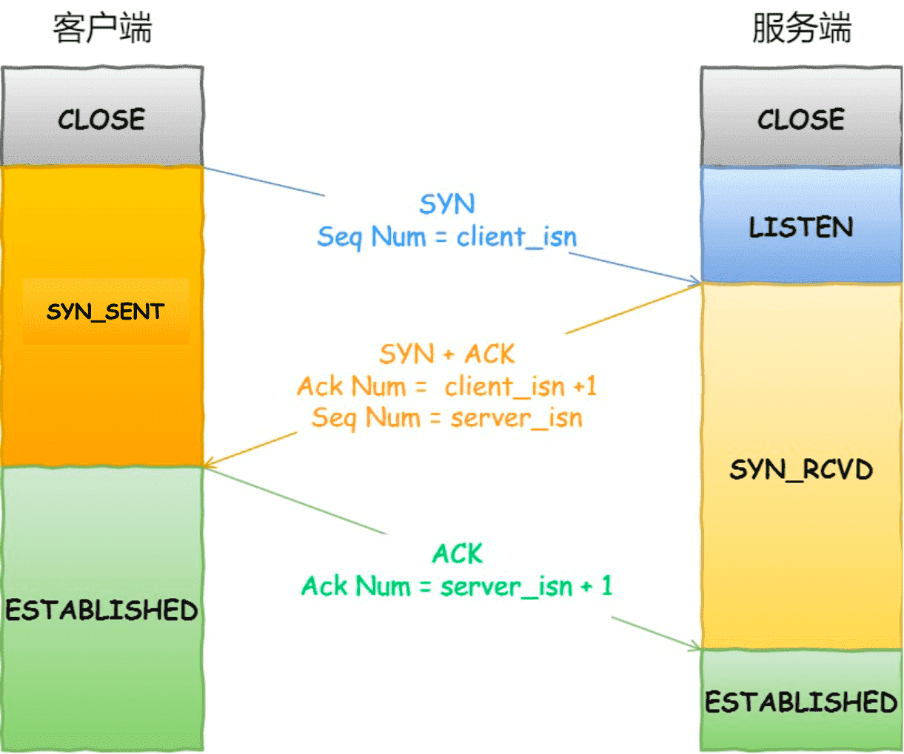

TCP 三次握手与四次挥手
===

## 什么是TCP，什么是TCP连接

TCP 是**面向连接的、可靠的、基于字节流**的传输层通信协议。

- 面向连接：一对一的，不能多对多或者一对多。
- 可靠的：无论网络链路出现什么情况，一定保证报文的送达。
- 字节流：通过TCP传输，消息可能会被操作系统分组乘多个的TCP报文，不需要在IP分片。

TCP连接，**用于保证可靠性和流量控制维护的某些状态信息，这些信息的组合，包括 Socket、序列号和窗口大小称为连接。**

- socket：由IP地址和端口号组成。

- 序列号：用来解决乱序问题。

- 窗口大小：用来做流量控制。

## TCP头格式有哪些

- **序列号**：在建立连接时随机生成数作为初始值，通过SYN包发送给对端主机，每发送一次数据，就「累加」一次该「数据字节数」的大小。用来解决网络包乱序问题。

- **确认应答号**：对之前收到报文的一个确认，也表示期待下一次收到的序列号，用来解决丢包问题。

- **控制位**：
  - ACK：为1表示，确认应答有效。
  - RST：为1表示，表示TCP连接中出现异常必须强制断开连接。
  - SYN：为1表示，希望能够建立连接，并在其「序列号」的字段进行序列号初始值的设定。
  - FIN：为1表示，表示今后不会再有数据发送，希望断开连接。

## 为什么需要TCP协议？TCP工作在哪一层

`IP` 层是「不可靠」的，它不保证网络包的交付、不保证网络包的按序交付、也不保证网络包中的数据的完整性。

如果需要保障网络数据包的可靠性，那么就需要由上层（传输层）的 `TCP` 协议来负责。

因为 TCP 是一个工作在**传输层**的**可靠**数据传输的服务，它能确保接收端接收的网络包是**无损坏、无间隔、非冗余和按序的。**

## 如何唯一确定一个TCP连接

TCP 四元组可以唯一的确定一个连接，四元组包括源地址和目的地址放在IP报文中，源端口和目的端口存放在TCP头部当中。

源地址和目的地址区分设备地址，而进程号则具体区分设备中的某个进程。

**有一个IP的服务端监听了一个端口，它的TCP的最大连接数是多少**

> 服务端一般固定在一个端口进行监测，但是受文件描述符，内存限制。
>
> 实际主要由客户端的IP数和端口数决定最大连接数。

## TCP连接建立

### 三次握手的过程

1. 一开始，客户端和服务端都处于 `CLOSE` 状态。先是服务端主动监听某个端口，处于 `LISTEN` 状态
2. 客户端发起第一个连接，将控制位`SYN = 1`表示SYN报文，并且初始化一个客户端发送的序列号，之后客户端处于`SYN_SENT`，第一次不携带数据。
3. 服务端收到SYN报文后，也初始化了服务端的序列号，并也要将`ACK,SYN`置为1，表示SYN请求报文，以及确认之前报文收到，确认应答有效，此时服务器处于`SYN_RCVD`状态。
4. 客户端收到后，再对服务器的序列号做出确认应答，此时客户端连接已经建立
5. 服务端收到确认报文后，建立连接。

> 1. 控制位的变化
>2. 序列号、确认应答号的变化
> 3. 三次握手哪一次开始携带数据

### 为什么需要三次，不是两次，四次

因为三次握手才能保证双方具有接收和发送的能力。

**避免历史连接**

在发生网络拥塞时，或者客户端宕机时，延迟了一个`SYN`报文，当客户端重启，后服务端先收到了旧的`SYN`报文，如果是两次握手，那么服务端直接进入连接建立状态，开始发送数据，而客户端发现收到的`ACK`报文不是自己想要的（旧的），那么就会发送`RST`报文中止连接，造成了不必要的资源浪费，服务端在收到`RST`报文时，才会终止连接。

通过三次回收，保证客户端确认是需要建立的连接，再进入连接建立状态更有效。

**同步双方初始序列号**

在第一次握手发送`SYN`报文时，客户端初始化了自己的序列号，服务端收到后对序列号进行了确认。

这样可以保证：

- 接收方可以去除重复的数据；
- 接收方可以根据数据包的序列号按序接收；
- 可以标识发送出去的数据包中， 哪些是已经被对方收到的（通过` ACK` 报文中的序列号知道）；

同样，服务端应该也要收到来自客户端的序列号确认，这样才能保证双方的初试序列号能够可靠的同步。

四次握手就是合并了发送`SYN`报文和`ACK`报文的过程。

**避免资源浪费**

如果没有第三次握手，在客户端发送的`SYN`报文拥堵后，重发，每次服务端接收到都会建立无效的连接，造成重复分配资源。

### 为什么每次初始化序列号不同

主要原因有两个方面：

- 为了防止历史报文被下一个相同四元组的连接接收（主要方面），造成数据混乱；
- 为了安全性，防止黑客伪造的相同序列号的 TCP 报文被对方接收；

### 初始序列号 ISN 是如何随机产生的？

起始 `ISN` 是基于时钟的，每 4 微秒 + 1，转一圈要 4.55 个小时。

RFC793 提到初始化序列号 ISN 随机生成算法：ISN = M + F(localhost, localport, remotehost, remoteport)。

- `M` 是一个计时器，这个计时器每隔 4 微秒加 1。
- `F` 是一个 Hash 算法，根据源 IP、目的 IP、源端口、目的端口生成一个随机数值。要保证 Hash 算法不能被外部轻易推算得出，用 MD5 算法是一个比较好的选择。

可以看到，随机数是会基于时钟计时器递增的，基本不可能会随机成一样的初始化序列号。

### IP分层，为什么还要TCP层MSS

负责报文超时和重传的是TCP层，当某一个 IP 分片丢失后，接收方的 IP 层就无法组装成一个完整的 TCP 报文（头部 + 数据），也就无法将数据报文送到 TCP 层，所以接收方不会响应 ACK 给发送方，因为发送方迟迟收不到 ACK 确认报文，所以会触发超时重传，就会重发「整个 TCP 报文（头部 + 数据）」。

在TCP层发现数据超过MSS时，就会先进行分片，同时在发现IP包长度大于MTU时，也不会进行IP分片。经过 TCP 层分片后，如果一个 TCP 分片丢失后，**进行重发时也是以 MSS 为单位**，而不用重传所有的分片，大大增加了重传的效率。

> MTU：一个网络包的最大长度，以太网中一般为 1500 字节；
> MSS：除去 IP 和 TCP 头部之后，一个网络包所能容纳的 TCP 数据的最大长度；

### 第一次握手丢失

客户端没有收到SYN-ACK报文，不断重发，重发次数由系统设置，重发SYN报文的间隔是上一次的翻倍，直到超过次数后断开连接。

### 第二次报文丢失

第二次报文丢失，客户端没有收到确认报文，所以会重发，而服务端也没有收到ACK报文，服务端同样会进行重发，有重发间隔和次数的限定。

### 第三次报文丢失

**ACK 报文是不会有重传的，当 ACK 丢失了，就由服务端重传对应的报文**。服务端认为自己发送的SYN-ACK报文失败。

> 为什么ACK报文不会重传呢
>
> 服务端发送很多次第2个包之后没有收到第3个包，直到超时，此时才算是握手失败，不会重传ACK报文，直接发送RST报文然后进入closed状态。这样是防止SYN攻击。(超时即失败，不超时并且没有收到第3个包还会重传)

### 什么是 SYN 攻击？如何避免 SYN 攻击？

我们都知道 TCP 连接建立是需要三次握手，假设攻击者短时间伪造不同 IP 地址的 `SYN` 报文，服务端每接收到一个 `SYN` 报文，就进入`SYN_RCVD` 状态，但服务端发送出去的 `ACK + SYN` 报文，无法得到未知 IP 主机的 `ACK` 应答，久而久之就会**占满服务端的半连接队列**，使得服务端不能为正常用户服务。

> 在TCP三次握手时，Linux会维护两个队列，
>
> 半连接队列（SYN队列）：在服务端收到客户端的SYN报文时，将其加入内核的SYN队列当中。
>
> 全连接队列（Accept队列）：在服务端收到ACK报文后，取出一个SYN队列中的对象，创建一个新的连接对象放到Accept队列中。

避免 SYN 攻击方式，可以有以下四种方法：

- 调大 netdev_max_backlog，当网卡接受数据包的速度大于内核处理速度时，用一个队列保存这些数据包。
- 增大 TCP 半连接队列；
- 开启 tcp_syncookies，在不使用 SYN 半连接队列的情况下成功建立连接，相当于绕过了 SYN 半连接来建立连接。
- 减少 SYN+ACK 重传次数，更快断开非法的连接，减轻服务器压力。

## TCP连接断开

### 四次挥手的过程

1. 首先主动发起方，发起FIN报文，告知服务端我要断开TCP连接了，但还是要接受服务端未发完的数据，进入FIN_WAIT状态。
2. 服务端收到后，回复一个ACK报文，确认收到报文，此时还有数据需要处理或者数据发送，因此不会同时发送FIN报文，进入CLOSE_WAIT状态。
3. 客户端收到ACK报文后，进入FIN_WAIT2状态，这个状态不能维系太久。
4. 服务端处理完数据后，发送FIN报文，准备关闭连接。
5. 客户端收到FIN报文后，进入TIME_WAIT状态，做最后的处理，2MSL后自动进入CLOSE状态，主动发起关闭连接的一方才会有TIME_WAIT状态。

### 为什么需要四次挥手

因为在上方提到了，等到服务端不再发送数据时，才会正式发送FIN报文告知另一方，同意关闭现在的连接。

但是**在特定情况下，四次挥手是可以变成三次挥手的**，具体情况可以看这篇：[TCP 四次挥手，可以变成三次吗？](https://xiaolincoding.com/network/3_tcp/tcp_three_fin.html)

### 第一次挥手丢失

主动发起方，没有收到ACK报文，会触发超时重传FIN报文，同样有实际的超时重传的次数和间隔时间的限制。就不再发送 FIN 报文，则会在**等待一段时间**（时间为上一次超时时间的 2 倍），如果还是没能收到第二次挥手，那么直接进入到 `close` 状态。

### 第二次挥手丢失

同样，客户端没有收到ACK报文，还是会重传FIN报文，ACK报文并不会重传，超过一定时间后直接进入 `close` 状态。

### 第三次挥手丢失

此时客户端收到了ACK报文，会进入TIME_WAIT2，等到服务端发送FIN报文。

> 对于 close 函数关闭的连接，由于无法再发送和接收数据，所以`FIN_WAIT2` 状态不可以持续太久，而 `tcp_fin_timeout` 控制了这个状态下连接的持续时长，默认值是 60 秒。如果在 60 秒后还没有收到 FIN 报文，客户端（主动关闭方）的连接就会直接关闭。

但是注意，如果主动关闭方使用 `shutdown函数`关闭连接，指定了只关闭发送方向，而接收方向并没有关闭，那么意味着主动关闭方还是可以接收数据的。此时，如果主动关闭方一直没收到第三次挥手，那么主动关闭方的连接将会一直处于 `FIN_WAIT2` 状态（`tcp_fin_timeout` 无法控制 `shutdown` 关闭的连接）。

FIN报文丢失，导致客户端没有收到并发送ACK报文，那么服务端会重发FIN报文，有重传时间和间隔的设置，最终也会关闭连接。

### 第四次挥手丢失

收到服务端的FIN报文后，客户端会进入TIME_WAIT状态，等2MSL定时，最终关闭连接。

但是服务端在发送FIN报文后，处于LAST_ACK状态，没有收到ACK报文，ACK报文不会重发，服务端会重发FIN报文，客户端收到FIN报文后，会**重置计时**。

### 为什么需要TIME_WAIT状态

主动发起关闭连接的一方，才会有 `TIME-WAIT` 状态。

> 序列号（SEQ）：保证消息（字节流）的可靠性和顺序性，以便传输后确认、丢失后重传以及接受方乱序问题。序列号是一个 32 位的无符号数，因此在到达 4G 之后再循环回到 0。
>
> 因此新旧连接之间，如果没有一定间隔，会有一点关联性，可能会被误接受。

需要 TIME-WAIT 状态，主要是两个原因：

- 防止历史连接中的数据，被后面相同四元组的连接错误的接收；
  - 之前网络延迟的数据内容，序列号还在新连接接受窗口内，会被错误接受。
  - 2MSL时间足以让两个方向上的数据包都被丢弃，使得原来连接的数据包在网络中都自然消失，再出现的数据包一定都是新建立连接所产生的。
- 保证「被动关闭连接」的一方，能被正确的关闭；
  - 至少保证一次FIN报文的重发，让客户端安全的关闭。
  - 如果没有这个状态，客户端直接进入CLOSE状态，服务端重发FIN报文，客户端收到后直接RST报文，这是一个不优雅的终止方式，服务端期盼收到的是之前FIN报文的ACK报文，而不是直接的RST报文，认为这是一个报文。

### 为什么TIME_WAIT等待时间是2MSL

`MSL` 是 Maximum Segment Lifetime，**报文最大生存时间**，它是任何报文在网络上存在的最长时间，超过这个时间报文将被丢弃。

TIME_WAIT 等待 2 倍的 MSL，比较合理的解释是：ACK丢失发送一个来回时间，FIN重发一个时间。可以看到 **2MSL时长** 这其实是相当于**至少允许报文丢失一次**。

`2MSL` 的时间是从**客户端接收到 FIN 后发送 ACK 开始计时的**。如果在 TIME-WAIT 时间内，因为客户端的 ACK 没有传输到服务端，客户端又接收到了服务端重发的 FIN 报文，那么 **2MSL 时间将重新计时**。

### 服务器出现大量 TIME_WAIT 状态的原因有哪些？

TIME_WAIT 状态是主动关闭连接方才会出现的状态，所以如果服务器出现大量的 TIME_WAIT 状态的 TCP 连接，就是说明服务器主动断开了很多 TCP 连接。

**什么场景下服务端会主动断开连接呢？**

- 第一个场景：HTTP 没有使用长连接

> 双方有一方设置了`Connection:close`，都会关闭长连接。
>
> **从 HTTP/1.1 开始， 默认是开启了 Keep-Alive**，现在大多数浏览器都默认是使用 HTTP/1.1，所以 Keep-Alive 都是默认打开的。一旦客户端和服务端达成协议，那么长连接就建立好了。
>
> **根据大多数 Web 服务的实现，不管哪一方禁用了 HTTP Keep-Alive，都是由服务端主动关闭连接**，那么此时服务端上就会出现 TIME_WAIT 状态的连接。
>
> **当服务端出现大量的 TIME_WAIT 状态连接的时候，可以排查下是否客户端和服务端都开启了 HTTP Keep-Alive**，因为任意一方没有开启 HTTP Keep-Alive，都会导致服务端在处理完一个 HTTP 请求后，就主动关闭连接，此时服务端上就会出现大量的 TIME_WAIT 状态的连接。

- 第二个场景：HTTP 长连接超时

> 有大量的客户端建立完 TCP 连接后，很长一段时间没有发送数据，那么大概率就是因为 HTTP 长连接超时，导致服务端主动关闭连接，产生大量处于 TIME_WAIT 状态的连接。
>
> Web软件会设置一个超时时间，来避免资源的浪费。
>
> 实际中也有可能是网络问题，导致客户端发送数据服务端没有接收到，导致长链接超时。

- 第三个场景：HTTP 长连接的请求数量达到上限

> 定义一条 HTTP 长连接上最大能处理的请求数量，当超过最大限制时，就会服务端主动关闭连接，从而产生大量的TIME_WAIT。

### TIME_WAIT 过多有什么危害？

- 第一是占用系统资源，比如文件描述符、内存资源、CPU 资源、线程资源等；
- 第二是占用端口资源，端口资源也是有限的，一般可以开启的端口为 `32768～61000`，也可以通过 `net.ipv4.ip_local_port_range`参数指定范围。

**客户端**（发起连接方）都是和「目的 IP+ 目的 PORT 」都一样的服务端建立连接的话，当客户端的 TIME_WAIT 状态连接过多的话，就会受端口资源限制，如果占满了所有端口资源，那么就无法再跟「目的 IP+ 目的 PORT」都一样的服务端建立连接了。

如果**服务端**（主动发起关闭连接方）的 TIME_WAIT 状态过多，并不会导致端口资源受限，因为服务端只监听一个端口，而且由于一个四元组唯一确定一个 TCP 连接，因此理论上服务端可以建立很多连接，但是 TCP 连接过多，会占用系统资源，比如文件描述符、内存资源、CPU 资源、线程资源等。

### 如何优化 TIME_WAIT？

- 打开 net.ipv4.tcp_tw_reuse 和 net.ipv4.tcp_timestamps 选项：复用处于 TIME_WAIT 的 socket 为新的连接所用，只能用于客户端。
- net.ipv4.tcp_max_tw_buckets：当系统中处于 TIME_WAIT 的连接一旦超过这个值时，系统就会将后面的 TIME_WAIT 连接状态重置，这个方法比较暴力。
- 程序中使用 SO_LINGER ，应用强制使用 RST 关闭。

> 《UNIX网络编程》一书中却说道：TIME_WAIT 是我们的朋友，它是有助于我们的，不要试图避免这个状态，而是应该弄清楚它。
>
> 如果服务端要避免过多的 TIME_WAIT 状态的连接，就永远不要主动断开连接，让客户端去断开，由分布在各处的客户端去承受 TIME_WAIT。

 ### 服务器出现大量 CLOSE_WAIT 状态的原因有哪些？

CLOSE_WAIT 状态是「被动关闭方」才会有的状态，而且如果「被动关闭方」没有调用 close 函数关闭连接，那么就无法发出 FIN 报文，从而无法使得 CLOSE_WAIT 状态的连接转变为 LAST_ACK 状态。

所以，**当服务端出现大量 CLOSE_WAIT 状态的连接的时候，说明服务端的程序没有调用 close 函数关闭连接**。

一个普通的 TCP 服务端的流程：

1. 创建服务端 socket，bind 绑定端口、listen 监听端口
2. 将服务端 socket 注册到 epoll
3. epoll_wait 等待连接到来，连接到来时，调用 accpet 获取已连接的 socket
4. 将已连接的 socket 注册到 epoll
5. epoll_wait 等待事件发生
6. 对方连接关闭时，我方调用 close

> 1. 在第二步中，没有正确注册监听socket到epoll内核中，无法监听新事件到来，也无法正确调用close函数进行关闭。
> 2. 第三步中，没有正确接受新连接，导致客户端主动断开连接，服务器没有机会调用close函数。
> 3. 第四步，已经连接的socket，没有将其注册到epoll当中，导致后续接收到FIN报文，没有监听到事件，服务端没法调用close函数
> 4. 第六步中，没有调用close函数，可能是楼处理，或者在close函数之前发生错误。

### 如果已经建立了连接，但是客户端突然出现故障了怎么办？

客户端发生宕机问题，服务端仍然处于ESTABLISH状态，占用系统资源，为了避免这个问题，TCP拥有**保活机制**。

> 定义一个时间段，在这个时间段内，如果没有任何连接相关的活动，TCP 保活机制会开始作用，每隔一个时间间隔，发送一个探测报文，该探测报文包含的数据非常少，如果连续几个探测报文都没有得到响应，则认为当前的 TCP 连接已经死亡，系统内核将错误信息通知给上层应用程序。

- 对端程序能够正常工作时，收到TCP保活探测报文时，对端正常相应，并且保活时间会被重置。
- 对端主机宕机重启，收到TCP保活探测报文后，对端响应RST报文（因为之前的TCP连接被重置了，没有有效的连接信息），服务端也会重置连接。
- 对端主机宕机等原因，导致报文不可到达时，当 TCP 保活的探测报文发送给对端后，石沉大海，没有响应，连续几次，达到保活探测次数后，TCP 会报告该 TCP 连接已经死亡。

> 实际中，TCP保活的这个机制检测时间过长，可以设置一个心跳机制，来指定长链接的超时时间，定时时间到达后，就通过回调函数释放这个链接。

### 如果已经建立了连接，但是服务端的进程崩溃会发生什么？

TCP 的连接信息是由内核维护的，所以当服务端的进程崩溃后，内核需要回收该进程的所有 TCP 连接资源，于是内核会发送第一次挥手 FIN 报文，后续的挥手过程也都是在内核完成，并不需要进程的参与，所以即使服务端的进程退出了，还是能与客户端完成 TCP 四次挥手的过程。
