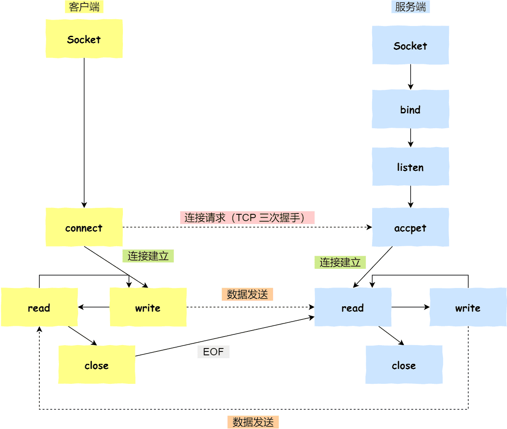

Socket编程
===

## TCP通信在socket中




## listen 时候参数 backlog 的意义？

```cpp
int listen (int socketfd, int backlog)
```

- 参数一 socketfd 为 socketfd 文件描述符
- 参数二 backlog，这参数在历史版本有一定的变化

在早期 Linux 内核 backlog 是 SYN 队列大小，也就是未完成的队列大小。

在 Linux 内核 2.2 之后，backlog 变成 accept 队列，也就是已完成连接建立的队列长度，**所以现在通常认为 backlog 是 accept 队列。**

## accept 发生在三次握手的哪一步？

客户端 connect 成功返回是在第二次握手，服务端 accept 成功返回是在三次握手成功之后。

第三次握手过程中可能包含数据。

## 客户端调用 close 了，连接是断开的流程是什么？

调用`close()`函数发生在发送FIN报文时。

服务端接收到了 FIN 报文，TCP 协议栈会为 FIN 包插入一个文件结束符 `EOF` 到接收缓冲区中，应用程序可以通过 `read` 调用来感知这个 FIN 包。

这个 `EOF` 会被**放在已排队等候的其他已接收的数据之后**，这就意味着服务端需要处理这种异常情况，因为 EOF 表示在该连接上再无额外数据到达。此时，服务端进入 CLOSE_WAIT 状态；

服务端处理完数据后，发送FIN报文确认关闭，调用`close()`函数。

