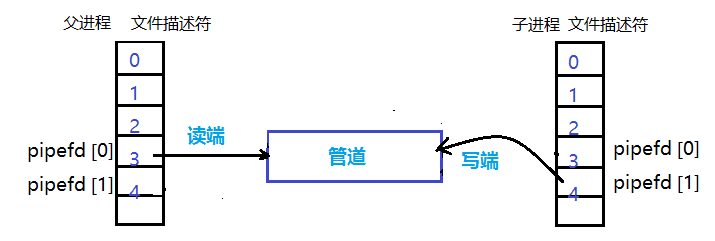

Lab Util
===

## C

- **, *,指针
- static静态变量的定义和使用

## Sleep

## PingPong

### 管道

- 单向的，父子进程之间通信需要一对。
- 资源有限关闭用不到的管道端口

对于父进程中的pipefd[2]，在子进程中同样有这样一套，指向管道的两端，当我们封闭一段形成一个单向的管道时，因为管道是**单向**的，就可以进程间通信了。

如果需要进行双向通信，因为一个管道是单向的，需要两个管道。

https://www.cnblogs.com/MrListening/p/5858358.html

> - 这里及时关闭一端管道，变成管道是只写只读，是为了节省资源，fd是有限的
> - close(fd)出于资源和安全

## Prime

## find

### API

- int fstat （int filedes，struct ＊buf）；

  - fstat（）用来将参数filedes 所指向的文件状态复制到参数buf 所指向的结构中（struct stat）
  - 执行成功返回0，失败返回－1，错误代码保存在errno。
  - 与stat函数功能相同
- void *memmove(void *str1, const void *str2, size_t n)

  - 对比memcpy，更加安全

- struct dirent de
  - 读取当前文件 / 文件夹内对应的内容

流程

- 判断当前路径的权限
- while打开当前路径的文件 / 文件夹
  - 比如打开 `.`
  - 添加路径为`p = ./`
  - 读取当前路径的文件为，`de.name`
  -  当前一个文件路径可以表示为`./a`
  - 判断当前路径能够打开
  - 判断这个路径的变量类型，是文件夹还是文件
    - 文件比较内容
    - 文件夹递归，但是避免递归`.`和`..`

> p指针的指向buf字符串，观察其变化
>
> DIRSIZE是什么
>
> gdb变量值的变化
>
> 及时关闭不用的文件描述符，包括异常时应该要关闭

