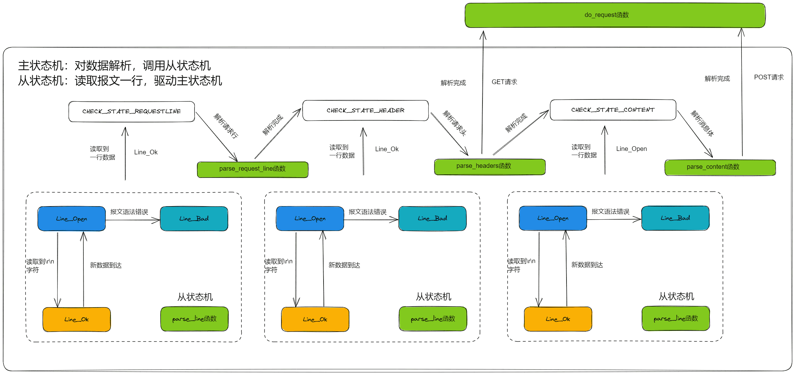

LoopEvent
===

## 有限状态机

有限状态机一种逻辑单元内部的一种高效编程方法，在服务器编程中，服务器可以根据不同状态或者消息类型进行相应的处理逻辑，使得程序逻辑清晰易懂。



### 主状态机

三种状态，标识解析位置。

```cpp
enum CHECK_STATE
{
    CHECK_STATE_REQUESTLINE = 0,            //检查请求行
    CHECK_STATE_HEAD,                       //检查请求头
    CHECK_STATE_CONTENT                     //检查请求体
};
```

### 从状态机

三种状态，标识解析一行的读取状态。

```cpp
enum LINE_STATE
{
    LINE_OK = 0,                            //行解析成功
    LINE_BAD,                               //语法错误
    LINE_OPEN                               //未获取到一行
};
```

## 整体流程描述

在一个循环内调用`epoll_wait`接收连接，然后分析得到的发生事件的fd

- 如果为新的客户端申请连接，调用`DealClientData()`
  - 接收连接
    - -1 accpet failure
    - 超过最大连接数
  - 初始化客户端信息
  - 设置该连接的定时器
- 如果为管道有信号到达，调用`DealWithSignal()`
  - 主要针对`SIGALARM`和`SIGTERM`信号，如果是`SIGALARM`，则设置`timeout_ = true`
- 如果为客户端的读事件，调用`DealWithRead()`
  - 增加该定时器时长
  - 将该时间放入线程池请求队列，线程竞争执行任务
  - 经过一个循环，待读事件完成操作完成后，进入循环内部判断是短连接还是长连接，短连接直接关闭。长连接将事件重新标记成未完成
- 如果为自己向客户端的写事件，调用`DealWithWrite()`
  - 与读事件类似
- 最后是定时器事件，通过`timer_flag`判断
  - 调用定时处理函数`TimerHandle()`，再在里面调用`tick()`函数检查到期的定时器，关闭连接
  - 继续调用alarm()`
- 如果是`if (events_[i].events & (EPOLLRDHUP | EPOLLHUP | EPOLLERR))`
  - 则关闭对应的文件描述符
  - 关闭对应的定时器

> 1. EINTR错误的产生：当阻塞于某个慢系统调用的一个进程捕获某个信号且相应信号处理函数返回时，该系统调用可能返回一个EINTR错误。
>
>    例如：在socket服务器端，设置了信号捕获机制，有子进程，当在父进程阻塞于慢系统调用时由父进程捕获到了一个有效信号时，内核会致使accept返回一个EINTR错误(被中断的系统调用)。

## ProcessRead

- 操作是否合法：判断超过缓冲区的大小
  - 保证数据一次性读完
  - 客户端关闭
  - 更新读取的位置

> 如果你连续做read操作而没有数据可读。此时程序不会阻塞起来等待数据准备就绪返回，read函数会返回一个错误EAGAIN / EWOULDBLOCK，应该break。这里应该是数据读完了。

### Paraline

在HTTP报文中，每一行的数据由\r\n作为结束字符，空行则是仅仅是字符\r\n，通过查找\r\n，改为\0行结束，读取每一行。

- 从状态机从m_read_buf中逐字节读取，判断当前字节是否为\r
  - 接下来的字符是\n，将\r\n修改成\0\0，将m_checked_idx指向下一行的开头，则返回LINE_OK
  - 接下来达到了buffer末尾，表示buffer还需要继续接收，返回LINE_OPEN
  - 否则，表示语法错误，返回LINE_BAD

- 当前字节不是\r，判断是否是\n（**一般是上次读取到\r就到了buffer末尾，没有接收完整，再次接收时会出现这种情况**）
  - 如果前一个字符是\r，则将\r\n修改成\0\0，将m_checked_idx指向下一行的开头，则返回LINE_OK
  - 当前字节既不是\r，也不是\n，返回LINE_BAD

- 表示接收不完整，需要继续接收，返回LINE_OPEN

**每次读取一行后，更新start_line为m_check_idx的位置，作为下一行的开始**

### ParaseRequestLine

> - `char* strpbrk( const char* dest, const char* breakset );`
>   - 读取在breakset中字符，在dest中第一次出现的位置。
>
> - `strcmp( const char *lhs, const char *rhs );`
>   - 用于比较两个字符串并根据比较结果返回整数。 基本形式为strcmp(str1,str2)，若str1=str2，则返回零；若str1<str2，则返回负数；若str1>str2，则返回正数。
> - `int strcasecmp (const char *s1, const char *s2)`
>   - 函数说明strcasecmp()用来比较参数s1和s2字符串，比较时会自动忽略大小写的差异。 
>   - 返回值 若参数s1和s2字符串相等则返回0。 s1大于s2则返回大于0 的值，s1 小于s2 则返回小于0的值。
>
> - `strncasecmp(const char *s1, const char *s2, size_t n)`
>   - strncasecmp()用来比较参数s1 和s2 字符串前n个字符，比较时会自动忽略大小写的差异。
>   - 若参数s1 和s2 字符串相同则返回0。s1 若大于s2 则返回大于0 的值，s1 若小于s2 则返回小于0 的值。
>
> - `strchr(const char *str, int c)`
>   - strchr函数功能为在一个串中查找给定字符的第一个匹配之处。 
>
> - `strspn(const char *str1, const char *str2)`
>   - 该函数返回 str1 中第一个不在字符串 str2 中出现的字符下标。

- `    GET /index.html HTTP/1.1\r\n`
- 用`strpbrk`找到非空位置，即划分了method，再用`strcasecmp`区分是GET还是POST
- `/index.html HTTP/1.1`
- 用`strpbrk`找到非空位置，即划分了version = HTTP/1.1
- 最后m_url是要访问资源的位置，/index.html
- 处理完后转向处理请求头

### ParseHeader

```html
Host: 192.168.142.27:5520\r\n
Connection: keep-alive\r\n
Upgrade-Insecure-Requests: 1\r\n
User-Agent: Mozilla/5.0 (Windows NT 10.0; Win64; x64) AppleWebKit/537.36 (KHTML, like Gecko) Chrome/110.0.0.0 Safari/537.36\r\n  Accept:text/html,application/xhtml+xml,application/xml;q=0.9,image/avif,image/webp,image/apng,*/*;q=0.8,application/signed-exchange;v=b3;q=0.7\r\n
Accept-Encoding: gzip, deflate\r\n
Accept-Language: zh-CN,zh;q=0.9\r\n
```

- 处理到请求头的末尾，m_content_length判断是不是需要去处理消息体
- 分别判断Host、Connection、等几个字段
- 这边每一个关键词都在一行，通过一行行判断，抓取空格之后的内容即可
- 处理完返回资源获取请求

### ParseContent

主要用于注册登录，账户和密码放在POST请求消息体内。

处理完返回资源获取请求

### Dorequest

在处理完请求头，没用消息体内容时对需要访问的资源做出响应，或者是处理完消息体内容后对需要做出相应的部分做出响应。

- 读取资源路径的根目录
- 将m_url，比如访问的/index.html路径给到m_read_file
- 判断是否有文件读的权限
- 只读打开文件的路径
- 使用创建的内存映射形式，读取访问所在文件
- 返回响应的判断

## ProcessWrite

写响应报文到写缓冲区当中。

- INTERNAL_ERROR
- BAD_REQUEST
- FILE_REQUEST

分别添加对应的相应的状态信息，使用的HTTP协议，消息体的长度和长短连接的判断。

这里用来iov的数组信息。

## Write

上面都完成了，要进行写事件，往connfd中写入响应报文。


