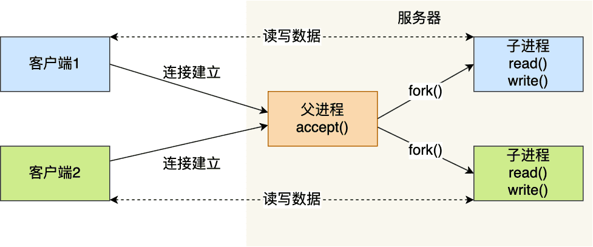

线程池
===

## 前置知识

### 五种I/O模型

- **阻塞IO**:调用者调用了某个函数，等待这个函数返回，期间什么也不做，不停的去检查这个函数有没有返回，必须等这个函数返回才能进行下一步动作
- **非阻塞IO**:非阻塞等待，每隔一段时间就去检测IO事件是否就绪。没有就绪就可以做其他事。非阻塞I/O执行系统调用总是立即返回，不管时间是否已经发生，若时间没有发生，则返回-1，此时可以根据errno区分这两种情况，对于accept，recv和send，事件未发生时，errno通常被设置成eagain
- **信号驱动IO**:linux用套接口进行信号驱动IO，安装一个信号处理函数，进程继续运行并不阻塞，当IO时间就绪，进程收到SIGIO信号。然后处理IO事件。
- **IO复用**:linux用select/poll函数实现IO复用模型，这两个函数也会使进程阻塞，但是和阻塞IO所不同的是这两个函数可以同时阻塞多个IO操作。而且可以同时对多个读操作、写操作的IO函数进行检测。知道有数据可读或可写时，才真正调用IO操作函数
- **异步IO**:linux中，可以调用aio_read函数告诉内核描述字缓冲区指针和缓冲区的大小、文件偏移及通知的方式，然后立即返回，当内核将数据拷贝到缓冲区后，再通知应用程序。

### 事件处理模式

- reactor模式中，主线程(**I/O处理单元**)只负责监听文件描述符上是否有事件发生，有的话立即通知工作线程(**逻辑单元** )，读写数据、接受新连接及处理客户请求均在工作线程中完成。通常由**同步I/O**实现。
- proactor模式中，主线程和内核负责处理读写数据、接受新连接等I/O操作，工作线程仅负责业务逻辑，如处理客户请求。通常由**异步I/O**实现。

### 同步I/O proactor

由于异步I/O并不成熟，实际中使用较少，这里将使用同步I/O模拟实现proactor模式。

> 同步I/O模型的工作流程如下（epoll_wait为例）：
>
> - 主线程往epoll内核事件表注册socket上的读就绪事件。
> - 主线程调用epoll_wait等待socket上有数据可读
> - 当socket上有数据可读，epoll_wait通知主线程,主线程从socket循环读取数据，直到没有更多数据可读，然后将读取到的数据封装成一个请求对象并插入请求队列。
> - 睡眠在请求队列上某个工作线程被唤醒，它获得请求对象并处理客户请求，然后往epoll内核事件表中注册该socket上的写就绪事件
> - 主线程调用epoll_wait等待socket可写。
> - 当socket上有数据可写，epoll_wait通知主线程。主线程往socket上写入服务器处理客户请求的结果。

### 半同步/半反应堆

半同步/半反应堆并发模式是半同步/半异步的变体，将半异步具体化为某种事件处理模式。

并发模式中的同步和异步

> - 同步指的是程序完全按照代码序列的顺序执行
> - 异步指的是程序的执行需要由系统事件驱动

半同步/半异步模式工作流程

> - 同步线程用于处理客户逻辑
> - 异步线程用于处理I/O事件
> - 异步线程监听到客户请求后，就将其封装成请求对象并插入请求队列中
> - 请求队列将通知某个工作在**同步模式的工作线程**来读取并处理该请求对象

半同步/半反应堆工作流程（以Proactor模式为例）

> - 主线程充当异步线程，负责监听所有socket上的事件
> - 若有新请求到来，主线程接收之以得到新的连接socket，然后往epoll内核事件表中注册该socket上的读写事件
> - 如果连接socket上有读写事件发生，主线程从socket上接收数据，并将数据封装成请求对象插入到请求队列中
> - 所有工作线程睡眠在请求队列上，当有任务到来时，通过竞争（如互斥锁）获得任务的接管权

### 多进程模型

基于最原始的阻塞网络 I/O， 如果服务器要支持多个客户端，其中比较传统的方式，就是使用**多进程模型**，也就是为每个客户端分配一个进程来处理请求。

服务器的主进程负责监听客户的连接，一旦与客户端连接完成，`accept() 函数`就会返回一个「已连接 Socket」，这时就通过 `fork()` 函数创建一个子进程，实际上就把父进程所有相关的东西都**复制**一份，包括文件描述符、内存地址空间、程序计数器、执行的代码等。

这两个进程刚复制完的时候，几乎一模一样。不过，会根据**返回值**来区分是父进程还是子进程，如果返回值是 0，则是子进程；如果返回值是其他的整数，就是父进程。

正因为子进程会**复制父进程的文件描述符**，于是就可以直接使用「已连接 Socket 」和客户端通信了，

可以发现，子进程不需要关心「监听 Socket」，只需要关心「已连接 Socket」；父进程则相反，将客户服务交给子进程来处理，因此父进程不需要关心「已连接 Socket」，只需要关心「监听 Socket」。

下面这张图描述了从连接请求到连接建立，父进程创建生子进程为客户服务。



另外，当「子进程」退出时，实际上内核里还会保留该进程的一些信息，也是会占用内存的，如果不做好“回收”工作，就会变成**僵尸进程**，随着僵尸进程越多，会慢慢耗尽我们的系统资源。

因此，父进程要“善后”好自己的孩子，怎么善后呢？那么有两种方式可以在子进程退出后回收资源，分别是调用 `wait()` 和 `waitpid()` 函数。

这种用多个进程来应付多个客户端的方式，在应对 100 个客户端还是可行的，但是当客户端数量高达一万时，肯定扛不住的，因为每产生一个进程，必会占据一定的系统资源，而且进程间上下文切换的“包袱”是很重的，性能会大打折扣。

> 进程的上下文切换不仅包含了虚拟内存、栈、全局变量等用户空间的资源，还包括了内核堆栈、寄存器等内核空间的资源。

### 多线程模型

线程是运行在进程中的一个“逻辑流”，单进程中可以运行多个线程，同进程里的线程可以共享进程的部分资源，比如文件描述符列表、进程空间、代码、全局数据、堆、共享库等，这些共享些资源在上下文切换时不需要切换，只需要切换线程的私有数据、寄存器等不共享的数据，因此同一个进程下的线程上下文切换的开销要比进程小得多。

当服务器与客户端 TCP 完成连接后，通过 `pthread_create()` 函数创建线程，然后将「已连接 Socket」的文件描述符传递给线程函数，接着在线程里和客户端进行通信，从而达到并发处理的目的。


### 线程池

我们每次接受一个HTTP连接，就创建一个线程来执行任务，这十分浪费效率。我们创建线程会涉及系统调用，开销比较大，不如一次性生成多个线程供我们所用。有新连接到达时，就从线程池中抽取一个线程来执行任务，其他线程没有任务时阻塞。

当新连接到来，我们调用线程池的函数插入任务到队列中，然后通过算法选出一个线程，该线程从任务队列中取出任务，然后执行处理函数。

那我们既然使用了多线程，就一定会涉及到线程的互斥，同步问题。

- 任务队列是公共资源，访问它必须保证互斥。
- 任务队列不为空时，线程才能从中取出任务，必须保证线程同步（生产者消费者模型）

所以，我们会需要用到互斥锁，条件变量，信号量。我们将这些操作封装成`Locker`类，在单独的文件中实现。

> 线程和进程的区别？

## 线程池类的定义

线程池的设计模式为半同步/半反应堆，其中反应堆具体为Proactor事件处理模式。

具体的，主线程为异步线程，负责监听文件描述符，接收socket新连接，若当前监听的socket发生了读写事件，然后将任务插入到请求队列。工作线程从请求队列中取出任务，完成读写数据的处理。

**考虑到实现，我们需要设置以下属性**

- 需要指定线程数量
- 需要指定任务队列的最大任务数
- 描述线程池的数组
- 请求队列
- 保护请求队列的互斥锁
- 对于读写事件的标志

```cpp
// 线程池类，将它定义为模板类是为了代码复用，模板参数T是任务类
template<typename T>
class ThreadPool {
public:
    /*thread_number是线程池中线程的数量，max_requests是请求队列中最多允许的、等待处理的请求的数量*/
    ThreadPool(int thread_number, int max_requests);
    ~ThreadPool();
    //插入任务函数
    bool Append(T* request, int event_flag);

private:
    /*工作线程运行的函数，它不断从工作队列中取出任务并执行之*/
    //线程被创建的时候被指明执行该函数,我们会将this指针传递进去,因为静态函数无法访问成员变量
    static void* ThreadWorkFunc(void* arg);
    void ThreadRun();

private:    
    int thread_number_;            // 线程的数量    
    int max_requests_;             // 请求队列中最多允许的、等待处理的请求的数量 
    pthread_t * threads_;          // 描述线程池的数组，大小为thread_number_    
    std::list< T* > workqueue_;    // 请求队列
    Locker queuelocker_;           // 保护请求队列的互斥锁
    Sem queuestat_;                // 是否有任务需要处理
    bool stop_;                    // 是否结束线程   
    int event_flag_;               // 0:读事件  1:写事件               
};
```

> `ThreadWorkFunc`如果是一个普通的类成员函数，那么自带的默认参数this指针，和函数原型的`void *`冲突了。

## 函数分析

### ThreadPool

- 我们需要对线程数和请求队列数进行判断，如果不满足会抛出异常
- 采用`new`动态分配线程池空间
- 循环创建多线程

- 设置线程为脱离态，自动回收资源

线程分离状态：指定该状态，线程主动与主控线程断开关系。线程结束后，其退出状态不由其他线程获取，而直接自己自动释放。网络、多线程服务器常用。

### Append

- 加锁保证线程安全
- 判断是否超过最大请求数
- 加入请求队列
- 解锁
- 信号量通知有任务未处理,唤醒wait的线程

> 操作工作队列时一定要加锁，因为它被所有线程共享。

### ThreadWorkFunc

我们之前向静态函数传递了`this`指针，用于方便访问`原对象`的成员变量，毕竟我们还需要使用这些锁，信号量等成员变量。我们创建了一个指向`ThreadPool`类型的`pool`指针接收我们的`this`指针。因为是`void *`类型，所以记得强制转换。

`pthread_create`函数指针，指向线程主函数(线程体)，该函数运行结束，则线程结束。

### ThreadRun

- 用信号量来保证线程同步
- 取出请求队列中的任务
- 判断读写任务，进行处理

## 整体流程

创建线程池，创建对应的线程，线程创建时调用对应函数，在函数中调用Run中根据信号量处理请求队列中的任务。

所有工作线程都睡眠在请求队列上，当有任务到来时，它们将通过竞争（比如申请互斥锁）获得任务的接管权。这种竞争机制使得只有空闲的工作线程才有机会来处理新任务。
